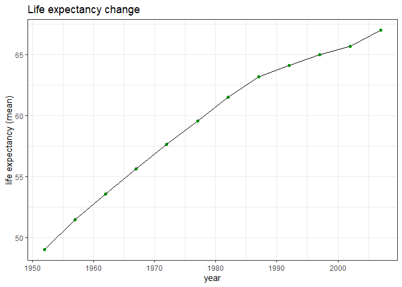
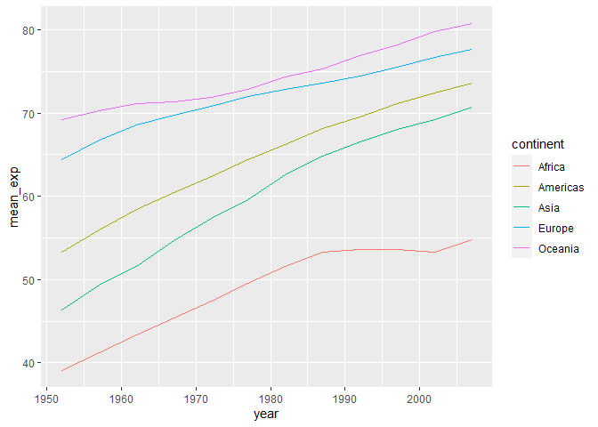
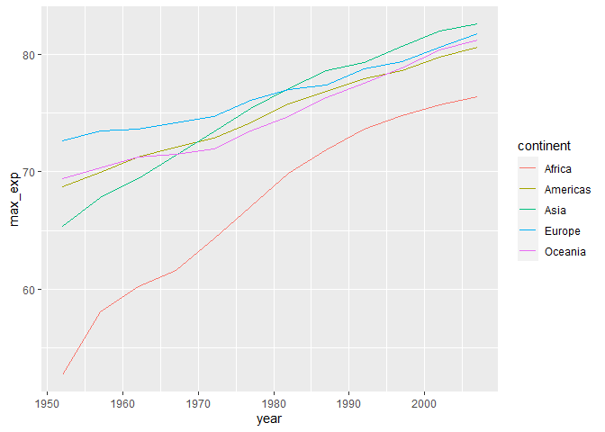
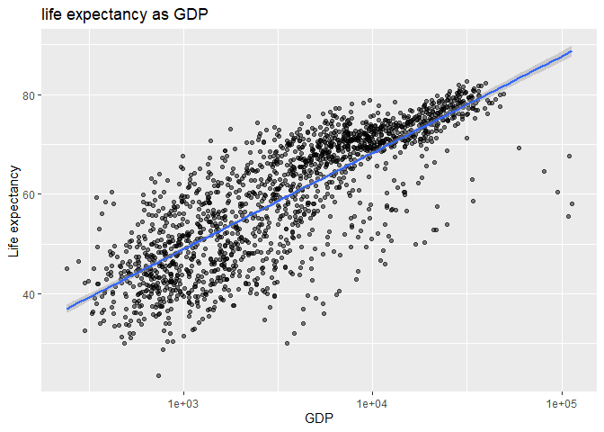
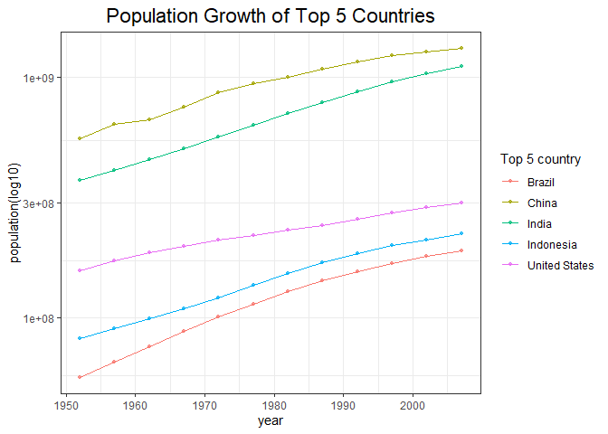
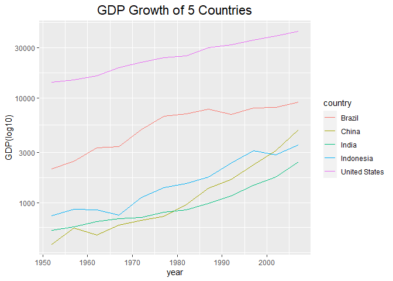
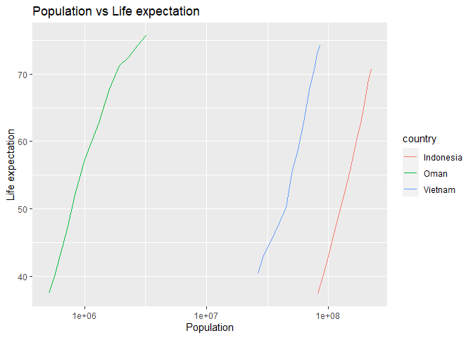

## Instructions
Answer the following questions and complete the exercises in RMarkdown. Please embed all of your code and push your final work to your repository. Your final lab report should be organized, clean, and run free from errors. Remember, you must remove the `#` for the included code chunks to run. Be sure to add your name to the author header above. For any included plots, make sure they are clearly labeled. You are free to use any plot type that you feel best communicates the results of your analysis.  

**In this homework, you should make use of the aesthetics you have learned. It's OK to be flashy!**

Make sure to use the formatting conventions of RMarkdown to make your report neat and clean!  

## Load the libraries

```r
library(tidyverse)
library(janitor)
library(here)
library(naniar)
```

## Resources
The idea for this assignment came from [Rebecca Barter's](http://www.rebeccabarter.com/blog/2017-11-17-ggplot2_tutorial/) ggplot tutorial so if you get stuck this is a good place to have a look.  

## Gapminder
For this assignment, we are going to use the dataset [gapminder](https://cran.r-project.org/web/packages/gapminder/index.html). Gapminder includes information about economics, population, and life expectancy from countries all over the world. You will need to install it before use. This is the same data that we will use for midterm 2 so this is good practice.

```r
#install.packages("gapminder")
library("gapminder")
```

## Questions
The questions below are open-ended and have many possible solutions. Your approach should, where appropriate, include numerical summaries and visuals. Be creative; assume you are building an analysis that you would ultimately present to an audience of stakeholders. Feel free to try out different `geoms` if they more clearly present your results.  

**1. Use the function(s) of your choice to get an idea of the overall structure of the data frame, including its dimensions, column names, variable classes, etc. As part of this, determine how NA's are treated in the data.**  

```r
summary(gapminder)
```

```
##         country        continent        year         lifeExp     
##  Afghanistan:  12   Africa  :624   Min.   :1952   Min.   :23.60  
##  Albania    :  12   Americas:300   1st Qu.:1966   1st Qu.:48.20  
##  Algeria    :  12   Asia    :396   Median :1980   Median :60.71  
##  Angola     :  12   Europe  :360   Mean   :1980   Mean   :59.47  
##  Argentina  :  12   Oceania : 24   3rd Qu.:1993   3rd Qu.:70.85  
##  Australia  :  12                  Max.   :2007   Max.   :82.60  
##  (Other)    :1632                                                
##       pop              gdpPercap       
##  Min.   :6.001e+04   Min.   :   241.2  
##  1st Qu.:2.794e+06   1st Qu.:  1202.1  
##  Median :7.024e+06   Median :  3531.8  
##  Mean   :2.960e+07   Mean   :  7215.3  
##  3rd Qu.:1.959e+07   3rd Qu.:  9325.5  
##  Max.   :1.319e+09   Max.   :113523.1  
## 
```


```r
glimpse(gapminder)
```

```
## Rows: 1,704
## Columns: 6
## $ country   <fct> "Afghanistan", "Afghanistan", "Afghanistan", "Afghanistan", ~
## $ continent <fct> Asia, Asia, Asia, Asia, Asia, Asia, Asia, Asia, Asia, Asia, ~
## $ year      <int> 1952, 1957, 1962, 1967, 1972, 1977, 1982, 1987, 1992, 1997, ~
## $ lifeExp   <dbl> 28.801, 30.332, 31.997, 34.020, 36.088, 38.438, 39.854, 40.8~
## $ pop       <int> 8425333, 9240934, 10267083, 11537966, 13079460, 14880372, 12~
## $ gdpPercap <dbl> 779.4453, 820.8530, 853.1007, 836.1971, 739.9811, 786.1134, ~
```


```r
names(gapminder)
```

```
## [1] "country"   "continent" "year"      "lifeExp"   "pop"       "gdpPercap"
```


**2. Among the interesting variables in gapminder is life expectancy. How has global life expectancy changed between 1952 and 2007?**

```r
gapminder<-clean_names(gapminder)
gapminder
```

```
## # A tibble: 1,704 x 6
##    country     continent  year life_exp      pop gdp_percap
##    <fct>       <fct>     <int>    <dbl>    <int>      <dbl>
##  1 Afghanistan Asia       1952     28.8  8425333       779.
##  2 Afghanistan Asia       1957     30.3  9240934       821.
##  3 Afghanistan Asia       1962     32.0 10267083       853.
##  4 Afghanistan Asia       1967     34.0 11537966       836.
##  5 Afghanistan Asia       1972     36.1 13079460       740.
##  6 Afghanistan Asia       1977     38.4 14880372       786.
##  7 Afghanistan Asia       1982     39.9 12881816       978.
##  8 Afghanistan Asia       1987     40.8 13867957       852.
##  9 Afghanistan Asia       1992     41.7 16317921       649.
## 10 Afghanistan Asia       1997     41.8 22227415       635.
## # ... with 1,694 more rows
```


```r
gapminder%>%
  filter(between(year,1952,2007))%>%
  group_by(year)%>%
  summarise(mean_life_exp=mean(life_exp))%>%
  ggplot(aes(x=year,y=mean_life_exp))+
  geom_line()+
  geom_point(color="green4")+
  labs(title = "Life expectancy change",
       x="year",
       y="life expectancy (mean)")+
  theme_bw()
```

<!-- -->


**3. How do the distributions of life expectancy compare for the years 1952 and 2007?**


```r
gapminder%>%
  select(year,life_exp)%>%
  filter(year=="1952"|year=="2007")%>%
  ggplot(aes(x=year,y=life_exp,color=year))+
  geom_jitter()
```

<!-- -->


**4. Your answer above doesn't tell the whole story since life expectancy varies by region. Make a summary that shows the min, mean, and max life expectancy by continent for all years represented in the data.**

```r
gapminder%>%
  group_by(continent,year)%>%
  summarise(min_exp=min(life_exp),mean_exp=mean(life_exp),max_exp=max(life_exp))%>%
  ggplot(aes(x=year,y=min_exp,color=continent))+
  geom_line()
```

```
## `summarise()` has grouped output by 'continent'. You can override using the
## `.groups` argument.
```

<!-- -->

```r
gapminder%>%
  group_by(continent,year)%>%
  summarise(min_exp=min(life_exp),mean_exp=mean(life_exp),max_exp=max(life_exp))%>%
  ggplot(aes(x=year,y=mean_exp,color=continent))+
  geom_line()
```

```
## `summarise()` has grouped output by 'continent'. You can override using the
## `.groups` argument.
```

<!-- -->

```r
gapminder%>%
  group_by(continent,year)%>%
  summarise(min_exp=min(life_exp),mean_exp=mean(life_exp),max_exp=max(life_exp))%>%
  ggplot(aes(x=year,y=max_exp,color=continent))+
  geom_line()
```

```
## `summarise()` has grouped output by 'continent'. You can override using the
## `.groups` argument.
```

<!-- -->

**5. How has life expectancy changed between 1952-2007 for each continent?**
same with #4

```r
levels(gapminder$continent)
```

```
## [1] "Africa"   "Americas" "Asia"     "Europe"   "Oceania"
```


**6. We are interested in the relationship between per capita GDP and life expectancy; i.e. does having more money help you live longer?**

```r
gapminder%>%
  ggplot(aes(x=gdp_percap,y=life_exp))+
  scale_x_log10()+
  geom_point(alpha=0.5)+
  geom_smooth(method=lm,se=T)+
  labs(title = "life expectancy as GDP",
       x="GDP",
       y="Life expectancy")
```

```
## `geom_smooth()` using formula 'y ~ x'
```

<!-- -->

**7. Which countries have had the largest population growth since 1952?**

```r
summary(gapminder)
```

```
##         country        continent        year         life_exp    
##  Afghanistan:  12   Africa  :624   Min.   :1952   Min.   :23.60  
##  Albania    :  12   Americas:300   1st Qu.:1966   1st Qu.:48.20  
##  Algeria    :  12   Asia    :396   Median :1980   Median :60.71  
##  Angola     :  12   Europe  :360   Mean   :1980   Mean   :59.47  
##  Argentina  :  12   Oceania : 24   3rd Qu.:1993   3rd Qu.:70.85  
##  Australia  :  12                  Max.   :2007   Max.   :82.60  
##  (Other)    :1632                                                
##       pop              gdp_percap      
##  Min.   :6.001e+04   Min.   :   241.2  
##  1st Qu.:2.794e+06   1st Qu.:  1202.1  
##  Median :7.024e+06   Median :  3531.8  
##  Mean   :2.960e+07   Mean   :  7215.3  
##  3rd Qu.:1.959e+07   3rd Qu.:  9325.5  
##  Max.   :1.319e+09   Max.   :113523.1  
## 
```

```r
gapminder%>%
  select(country,year,life_exp,pop)%>%
  filter(year=="1952"|year=="2007")%>%
  pivot_wider(names_from = year,values_from = c(life_exp,pop))%>%
  mutate(gap_pop=pop_2007-pop_1952)%>%
  arrange(desc(gap_pop))
```

```
## # A tibble: 142 x 6
##    country       life_exp_1952 life_exp_2007  pop_1952   pop_2007   gap_pop
##    <fct>                 <dbl>         <dbl>     <int>      <int>     <int>
##  1 China                  44            73.0 556263527 1318683096 762419569
##  2 India                  37.4          64.7 372000000 1110396331 738396331
##  3 United States          68.4          78.2 157553000  301139947 143586947
##  4 Indonesia              37.5          70.6  82052000  223547000 141495000
##  5 Brazil                 50.9          72.4  56602560  190010647 133408087
##  6 Pakistan               43.4          65.5  41346560  169270617 127924057
##  7 Bangladesh             37.5          64.1  46886859  150448339 103561480
##  8 Nigeria                36.3          46.9  33119096  135031164 101912068
##  9 Mexico                 50.8          76.2  30144317  108700891  78556574
## 10 Philippines            47.8          71.7  22438691   91077287  68638596
## # ... with 132 more rows
```


**8. Use your results from the question above to plot population growth for the top five countries since 1952.**

```r
gapminder%>%
  filter(country=="China"| country=="India"| country=="United States"| country=="Indonesia"|country=="Brazil")%>%
  filter(year>=1952)%>%
  ggplot(aes(x=year,y=pop,color=country))+
  scale_y_log10()+
  geom_line()+
  geom_point(size=1,alpha=0.7)+
  theme_bw()+
  labs(title = "Population Growth of Top 5 Countries",
       x="year",
       y="population(log10)",
       color="Top 5 country")+
  theme(plot.title = element_text(size = rel(1.5), hjust = 0.5))
```

<!-- -->

**9. How does per-capita GDP growth compare between these same five countries?**

```r
gapminder%>%
  filter(country=="China"| country=="India"| country=="United States"| country=="Indonesia"|country=="Brazil")%>%
  ggplot(aes(x=year,y=gdp_percap,color=country))+
  scale_y_log10()+
  geom_line()+
  theme_gray()+
  labs(title = "GDP Growth of 5 Countries",
       x="year",
       y="GDP(log10)",
       color="country")+
  theme(plot.title = element_text(size = rel(1.5), hjust = 0.5))
```

<!-- -->

**10. Make one plot of your choice that uses faceting!**

```r
gapminder%>%
  select(country,year,life_exp,pop)%>%
  filter(year=="1952"|year=="2007")%>%
  pivot_wider(names_from = year,values_from = c(life_exp,pop))%>%
  mutate(gap_lifeexp=life_exp_2007-life_exp_1952)%>%
  arrange(desc(gap_lifeexp))
```

```
## # A tibble: 142 x 6
##    country            life_exp_1952 life_exp_2007 pop_1952  pop_2007 gap_lifeexp
##    <fct>                      <dbl>         <dbl>    <int>     <int>       <dbl>
##  1 Oman                        37.6          75.6   507833   3204897        38.1
##  2 Vietnam                     40.4          74.2 26246839  85262356        33.8
##  3 Indonesia                   37.5          70.6 82052000 223547000        33.2
##  4 Saudi Arabia                39.9          72.8  4005677  27601038        32.9
##  5 Libya                       42.7          74.0  1019729   6036914        31.2
##  6 Korea, Rep.                 47.5          78.6 20947571  49044790        31.2
##  7 Nicaragua                   42.3          72.9  1165790   5675356        30.6
##  8 West Bank and Gaza          43.2          73.4  1030585   4018332        30.3
##  9 Yemen, Rep.                 32.5          62.7  4963829  22211743        30.2
## 10 Gambia                      30            59.4   284320   1688359        29.4
## # ... with 132 more rows
```

```r
gapminder%>%
  filter(country=="Oman"|country=="Vietnam"|country=="Indonesia")%>%
  ggplot(aes(x=pop,y=life_exp,color=country))+
  scale_x_log10()+
  geom_line()+
  labs(title = "Population vs Life expectation",
       x="Population",
       y="Life expectation")
```

<!-- -->


```r
gapminder
```

```
## # A tibble: 1,704 x 6
##    country     continent  year life_exp      pop gdp_percap
##    <fct>       <fct>     <int>    <dbl>    <int>      <dbl>
##  1 Afghanistan Asia       1952     28.8  8425333       779.
##  2 Afghanistan Asia       1957     30.3  9240934       821.
##  3 Afghanistan Asia       1962     32.0 10267083       853.
##  4 Afghanistan Asia       1967     34.0 11537966       836.
##  5 Afghanistan Asia       1972     36.1 13079460       740.
##  6 Afghanistan Asia       1977     38.4 14880372       786.
##  7 Afghanistan Asia       1982     39.9 12881816       978.
##  8 Afghanistan Asia       1987     40.8 13867957       852.
##  9 Afghanistan Asia       1992     41.7 16317921       649.
## 10 Afghanistan Asia       1997     41.8 22227415       635.
## # ... with 1,694 more rows
```


```r
gapminder%>%
  select(country,year,life_exp)%>%
  filter(year=="1952"|year=="2007")%>%
  pivot_wider(names_from = year,values_from = life_exp)%>%
  mutate(gap_lifeexp=2007-1952)%>% #Question_they recognize column name as real number 
  arrange(desc(gap_lifeexp))
```

```
## # A tibble: 142 x 4
##    country     `1952` `2007` gap_lifeexp
##    <fct>        <dbl>  <dbl>       <dbl>
##  1 Afghanistan   28.8   43.8          55
##  2 Albania       55.2   76.4          55
##  3 Algeria       43.1   72.3          55
##  4 Angola        30.0   42.7          55
##  5 Argentina     62.5   75.3          55
##  6 Australia     69.1   81.2          55
##  7 Austria       66.8   79.8          55
##  8 Bahrain       50.9   75.6          55
##  9 Bangladesh    37.5   64.1          55
## 10 Belgium       68     79.4          55
## # ... with 132 more rows
```

## Push your final code to GitHub!
Please be sure that you check the `keep md` file in the knit preferences. 
