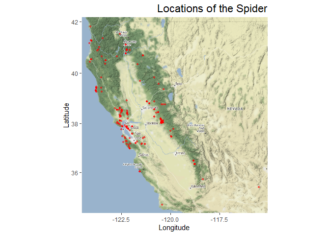
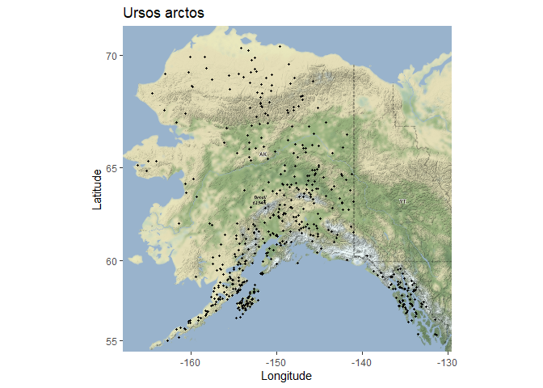

## Learning Goals
*At the end of this exercise, you will be able to:*  
1. Produce distribution maps in R.  
 
## Resources
[Overview of Cooordinate Reference Systems in R](https://www.nceas.ucsb.edu/~frazier/RSpatialGuides/OverviewCoordinateReferenceSystems.pdf)

## Spatial Data in R
There are many packages and techniques for working with spatial data in R. We will cover just some of the basics. One nice package is `ggmap`, which allows us to get base maps from Google Maps, OpenStreetMap, and Stamen Maps. It also works well with `ggplot2`.  

If you completed part 1 of today's lab then you should have the following packages installed. If not, then you should get them going now. You need to do these in order!  

`devtools` and `ggmap`

```r
#install.packages("devtools")
#library(devtools)
#devtools::install_github("dkahle/ggmap")
```

`albersusa`

```r
#install.packages("albersusa")
```

## Load the libraries

```r
library(tidyverse)
library(here)
library(janitor)
library(ggmap)
```

Let's load our processed data from the first part of the lab.

```r
spiders <- read_csv(here("lab12", "data", "spiders_with_locs.csv")) %>% clean_names()
```


```r
spiders
```

```
## # A tibble: 270 x 11
##    accession family    genus  country state county locality date       collector
##        <dbl> <chr>     <chr>  <chr>   <chr> <chr>  <chr>    <date>     <chr>    
##  1   9038521 Telemidae Usofi~ USA     Cali~ Alame~ Berkeley 2019-03-02 LM Smith 
##  2   9038522 Telemidae Usofi~ USA     Cali~ Alame~ Castro ~ 2019-03-24 WM Pearce
##  3   9038523 Telemidae Usofi~ USA     Cali~ Alame~ Niles, ~ 2019-01-02 V Roth   
##  4   9038524 Telemidae Usofi~ USA     Cali~ Alame~ Oakland  2019-02-18 WG Benti~
##  5   9038525 Telemidae Usofi~ USA     Cali~ Alame~ Oakland  2019-01-25 R Schust~
##  6   9038526 Telemidae Usofi~ USA     Cali~ Alame~ Oakland  2019-02-18 WC Benti~
##  7   9038527 Telemidae Usofi~ USA     Cali~ Alame~ Oakland  2019-12-10 J Helfer 
##  8  90386281 Telemidae Usofi~ USA     Cali~ Alame~ Oakland~ 2019-10-17 Roth, Sc~
##  9   9038529 Telemidae Usofi~ USA     Cali~ Alame~ Oakland~ 2019-10-17 Roth, Sc~
## 10  90387441 Telemidae Usofi~ USA     Cali~ Alame~ Berkele~ 2019-02-17 PR Craig~
## # ... with 260 more rows, and 2 more variables: latitude <dbl>, longitude <dbl>
```


There is an error in one of the coordinates that we will fix here.

```r
spiders <- spiders %>% filter(latitude<=42)
```

## Create Base Map
Our goal here is to plot the spiders locations from the columns which contain the latitude and longitude. First, we need to get a base map for plotting our points on. We could plot them without a base map, but that wouldn't give us any context as to where they are in space. To get a base map we specify a min and max of each x and y coordinate, and create a bounding box.  

We set the bounding box to a little outside our min and max locations with `f = 0.05`.    

`summary()` gives us our min and max.

```r
spiders %>% 
  select(latitude, longitude) %>% 
  summary()
```

```
##     latitude       longitude     
##  Min.   :34.67   Min.   :-124.1  
##  1st Qu.:37.88   1st Qu.:-122.5  
##  Median :38.19   Median :-122.1  
##  Mean   :38.47   Mean   :-121.6  
##  3rd Qu.:38.88   3rd Qu.:-120.5  
##  Max.   :41.80   Max.   :-115.5
```

Now we set the bounding box.

```r
lat <- c(34.67, 41.80)
long <- c(-124.1, -115.5)
bbox <- make_bbox(long, lat, f = 0.05)
```

Let's get a base map for our bounding box area. We will use the stamen maps because they are free. There are several different map types, including: `terrain-labels`, `terrain-lines`, `toner`, `toner-2011`, `toner-background`, `toner-hybrid`, `toner-lines`, `toner-lite`, and `watercolor.`

```r
map1 <- get_map(bbox, maptype = "terrain", source = "stamen")
```

```
## Map tiles by Stamen Design, under CC BY 3.0. Data by OpenStreetMap, under ODbL.
```


```r
ggmap(map1)
```

<!-- -->

## Adding Points to Base Map
`ggmap` works well with `ggplot2`. To add our points we only need to specify the x and y location similar to how we made charts in previous labs. 

```r
ggmap(map1) + 
  geom_point(data = spiders, aes(longitude, latitude)) +
  labs(x = "Longitude", y = "Latitude", title = "Spider Locations")
```

<!-- -->


```r
ggmap(map1)+
  geom_point(data=spiders, aes(longitude,latitude),size=1, color="red", alpha=0.5)+
  labs(x="Longitude", y="Latitude", title="Locations of the Spider")+
  theme(plot.title=element_text(size=rel(1.5),hjust = 1))
```

<!-- -->

## Practice
Let's practice with a data set that records sightings of grizzly bears (Ursos arctos) in Alaska [data set](https://rcweb.dartmouth.edu/~f002d69/workshops/index_rspatial.html).  

```r
grizzly <- read_csv(here("lab12", "data", "bear-sightings.csv"))
```

```
## Rows: 494 Columns: 3
## -- Column specification --------------------------------------------------------
## Delimiter: ","
## dbl (3): bear.id, longitude, latitude
## 
## i Use `spec()` to retrieve the full column specification for this data.
## i Specify the column types or set `show_col_types = FALSE` to quiet this message.
```


```r
summary(grizzly)
```

```
##     bear.id       longitude         latitude    
##  Min.   :   7   Min.   :-166.2   Min.   :55.02  
##  1st Qu.:2569   1st Qu.:-154.2   1st Qu.:58.13  
##  Median :4822   Median :-151.0   Median :60.97  
##  Mean   :4935   Mean   :-149.1   Mean   :61.41  
##  3rd Qu.:7387   3rd Qu.:-145.6   3rd Qu.:64.13  
##  Max.   :9996   Max.   :-131.3   Max.   :70.37
```


1. Use the range of the latitude and longitude to build an appropriate bounding box for your map.

```r
lat<-c(55.02,70.37)
long<-c(-131.3,-166.2)
bbox<-make_bbox(long,lat,f=0.05)
```

2. Load a map from `stamen` in a terrain style projection and display the map.

```r
map1<-get_map(bbox,maptype = "terrain",source="stamen")
```

```
## Map tiles by Stamen Design, under CC BY 3.0. Data by OpenStreetMap, under ODbL.
```


```r
ggmap(map1)
```

<!-- -->

3. Build a final map that overlays the recorded observations of grizzly bears in Alaska.

```r
ggmap(map1) + 
  geom_point(data = grizzly, aes(longitude, latitude), size=0.8) +
  labs(x = "Longitude", y = "Latitude", title = "Ursos arctos")
```

<!-- -->

## That's it, let's take a break!   

-->[Home](https://jmledford3115.github.io/datascibiol/)
