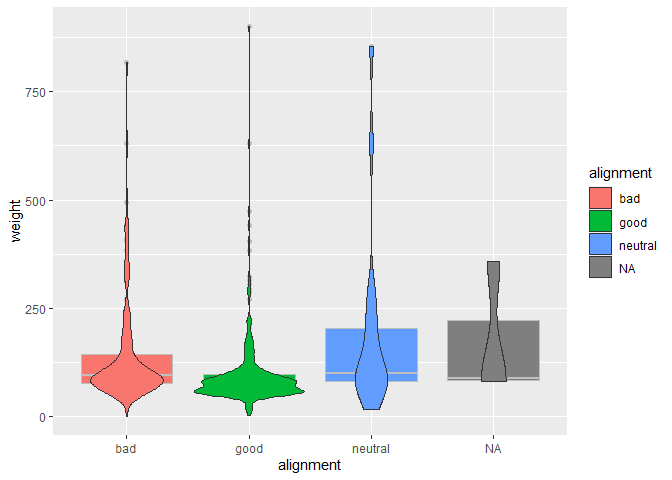
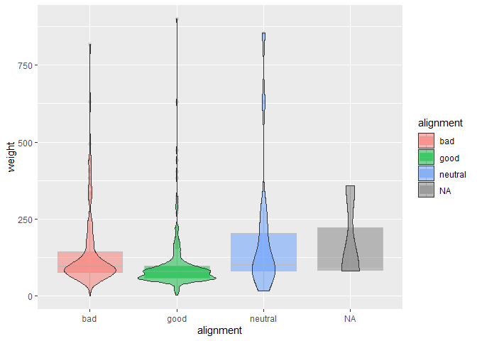
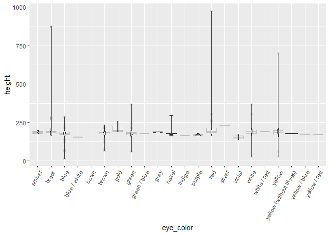
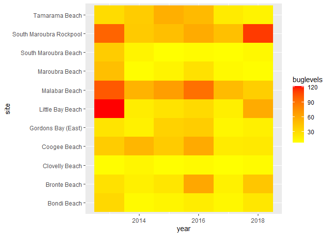
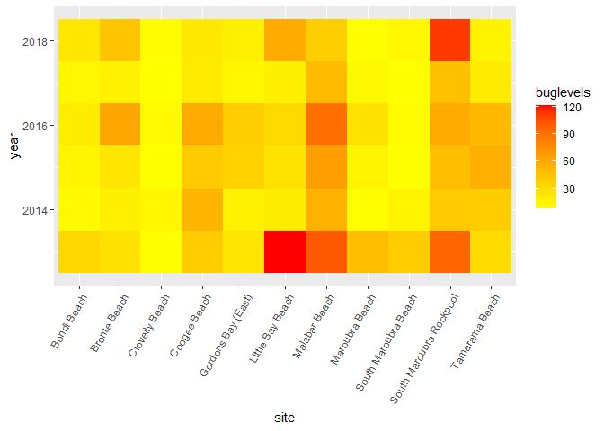
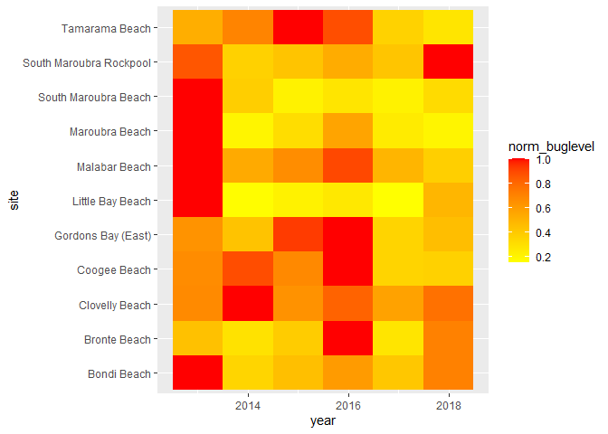
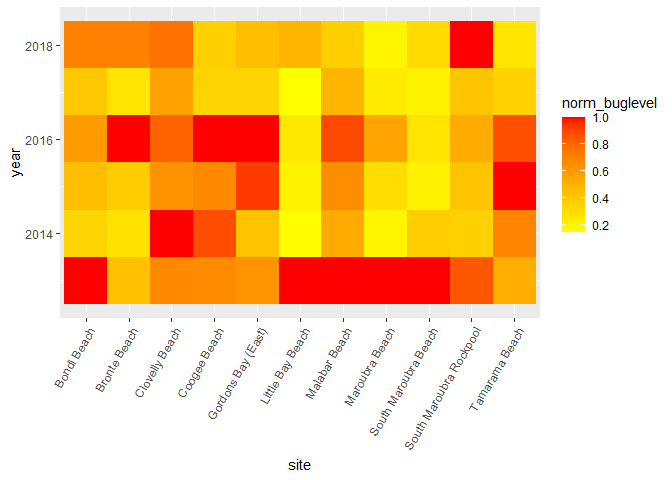
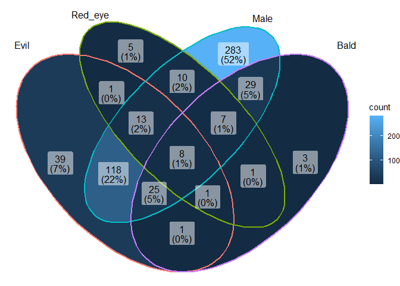
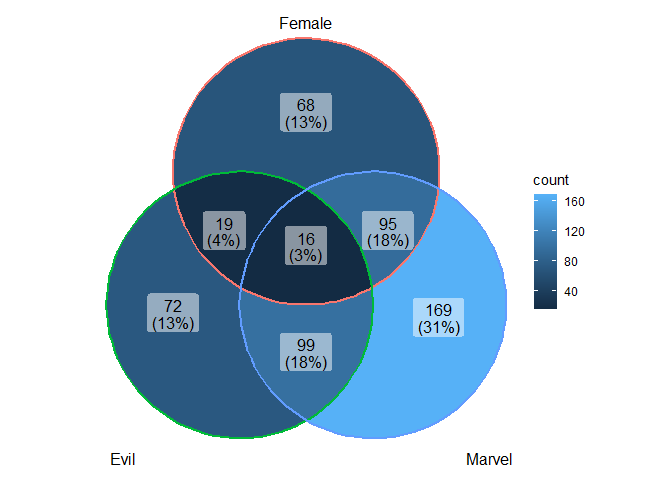
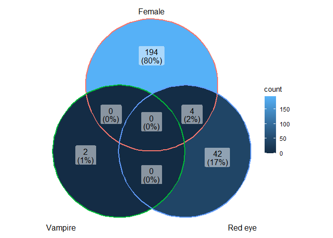

### Load the Libraries

```r
library(tidyverse)
```

```
## -- Attaching packages --------------------------------------- tidyverse 1.3.1 --
```

```
## v ggplot2 3.3.5     v purrr   0.3.4
## v tibble  3.1.6     v dplyr   1.0.8
## v tidyr   1.2.0     v stringr 1.4.0
## v readr   2.1.2     v forcats 0.5.1
```

```
## -- Conflicts ------------------------------------------ tidyverse_conflicts() --
## x dplyr::filter() masks stats::filter()
## x dplyr::lag()    masks stats::lag()
```

```r
library(janitor)
```

```
## 
## 다음의 패키지를 부착합니다: 'janitor'
```

```
## The following objects are masked from 'package:stats':
## 
##     chisq.test, fisher.test
```

```r
library("palmerpenguins")

#install.packages("ggVennDiagram")
library(ggVennDiagram)
library(RColorBrewer)

#install.packages("ggwordcloud")
library(ggwordcloud)


options(scipen=999) #cancels the use of scientific notation for the session
```


### Data

```r
superhero_info <- readr::read_csv("data/heroes_information.csv", na = c("", "-99", "-"))
```

```
## Rows: 734 Columns: 10
## -- Column specification --------------------------------------------------------
## Delimiter: ","
## chr (8): name, Gender, Eye color, Race, Hair color, Publisher, Skin color, A...
## dbl (2): Height, Weight
## 
## i Use `spec()` to retrieve the full column specification for this data.
## i Specify the column types or set `show_col_types = FALSE` to quiet this message.
```

```r
superhero_powers <- readr::read_csv("data/super_hero_powers.csv", na = c("", "-99", "-"))
```

```
## Rows: 667 Columns: 168
## -- Column specification --------------------------------------------------------
## Delimiter: ","
## chr   (1): hero_names
## lgl (167): Agility, Accelerated Healing, Lantern Power Ring, Dimensional Awa...
## 
## i Use `spec()` to retrieve the full column specification for this data.
## i Specify the column types or set `show_col_types = FALSE` to quiet this message.
```

```r
beachbugs_long <- readr::read_csv("data/beachbugs_long.csv")
```

```
## Rows: 66 Columns: 3
## -- Column specification --------------------------------------------------------
## Delimiter: ","
## chr (1): site
## dbl (2): year, buglevels
## 
## i Use `spec()` to retrieve the full column specification for this data.
## i Specify the column types or set `show_col_types = FALSE` to quiet this message.
```

### 1. 
Clean up the column names (no capitals, not spaces) of `superhero_info`, then use 2 functions to remind yourself of structure of the `superhero_info` data set.


```r
superhero_info<-clean_names(superhero_info)
```


```r
summary(superhero_info)
```

```
##      name              gender           eye_color             race          
##  Length:734         Length:734         Length:734         Length:734        
##  Class :character   Class :character   Class :character   Class :character  
##  Mode  :character   Mode  :character   Mode  :character   Mode  :character  
##                                                                             
##                                                                             
##                                                                             
##                                                                             
##   hair_color            height       publisher          skin_color       
##  Length:734         Min.   : 15.2   Length:734         Length:734        
##  Class :character   1st Qu.:173.0   Class :character   Class :character  
##  Mode  :character   Median :183.0   Mode  :character   Mode  :character  
##                     Mean   :186.7                                        
##                     3rd Qu.:191.0                                        
##                     Max.   :975.0                                        
##                     NA's   :217                                          
##   alignment             weight     
##  Length:734         Min.   :  2.0  
##  Class :character   1st Qu.: 61.0  
##  Mode  :character   Median : 81.0  
##                     Mean   :112.3  
##                     3rd Qu.:108.0  
##                     Max.   :900.0  
##                     NA's   :239
```


```r
head(superhero_info)
```

```
## # A tibble: 6 x 10
##   name   gender eye_color race  hair_color height publisher skin_color alignment
##   <chr>  <chr>  <chr>     <chr> <chr>       <dbl> <chr>     <chr>      <chr>    
## 1 A-Bomb Male   yellow    Human No Hair       203 Marvel C~ <NA>       good     
## 2 Abe S~ Male   blue      Icth~ No Hair       191 Dark Hor~ blue       good     
## 3 Abin ~ Male   blue      Unga~ No Hair       185 DC Comics red        good     
## 4 Abomi~ Male   green     Huma~ No Hair       203 Marvel C~ <NA>       bad      
## 5 Abrax~ Male   blue      Cosm~ Black          NA Marvel C~ <NA>       bad      
## 6 Absor~ Male   blue      Human No Hair       193 Marvel C~ <NA>       bad      
## # ... with 1 more variable: weight <dbl>
```

### 2.
Are bad guys bigger? Make box-plots of weight by `alignment` (alignment on the x-axis).

```r
superhero_info%>%
  ggplot(aes(x=alignment,y=weight))+
  geom_boxplot()
```

```
## Warning: Removed 239 rows containing non-finite values (stat_boxplot).
```

<!-- -->

### 3. 
Now, make a violin plot of weight by `alignment` (alignment on the x-axis). Add some color!
  What information can you observe in the violin plot that was not visible in the boxplot?
  we can know about perimeter distribution of the box

```r
superhero_info%>%
  ggplot(aes(alignment,weight,fill=alignment))+
  geom_boxplot(color="grey", na.rm=T)+
  geom_violin(na.rm=T)
```

<!-- -->


### 4. 
Use `alpha = .5` in `geom_boxplot()` and `geom_violin()` to layer both plots on top of one another. What does this tell you about the distribution of weight in "`bad`" guys?

```r
superhero_info%>%
  ggplot(aes(alignment,weight,fill=alignment))+
  geom_boxplot(color="grey", alpha=0.5, na.rm=T)+
  geom_violin(alpha=0.5, na.rm=T)
```

<!-- -->

### 5. 
Box plots are great for showing how the distribution of a numeric variable (e.g. weight) varies among a categorical variable (e.g. alignment).
  Make your own violin plot with the superhero data. 
  What is your numeric data? 
  What is your categorical variable?

```r
table(superhero_info$eye_color)
```

```
## 
##                   amber                   black                    blue 
##                       2                      23                     225 
##            blue / white                    bown                   brown 
##                       1                       1                     126 
##                    gold                   green            green / blue 
##                       3                      73                       1 
##                    grey                   hazel                  indigo 
##                       6                       6                       1 
##                  purple                     red                  silver 
##                       4                      46                       1 
##                  violet                   white             white / red 
##                       2                      17                       1 
##                  yellow yellow (without irises)           yellow / blue 
##                      19                       2                       1 
##            yellow / red 
##                       1
```

```r
superhero_info%>%
  filter(eye_color!="NA")%>%
  ggplot(aes(x=eye_color, y=height, fill(eye_color)))+
  geom_boxplot(color="grey", alpha=0.3, na.rm=T)+
  geom_violin(alpha=0.7,na.rm=T)+
  theme(axis.text.x = element_text(angle = 60, hjust=1))
```

```
## Warning: Groups with fewer than two data points have been dropped.
## Groups with fewer than two data points have been dropped.
## Groups with fewer than two data points have been dropped.
## Groups with fewer than two data points have been dropped.
## Groups with fewer than two data points have been dropped.
## Groups with fewer than two data points have been dropped.
## Groups with fewer than two data points have been dropped.
```

<!-- -->

### 6. 
Remind yourself what `beachbugs` looks like. Then generate a heatmap of buglevels by site and year. 
color it with `scale_fill_gradient(low="yellow", high="red")` or colors of your choice. you may find it looks best with one color!
(dont forget, `coord_flip()` is a quick way to improve the look of your plot if you dont like the default orientation)


```r
beachbugs_long
```

```
## # A tibble: 66 x 3
##     year site                    buglevels
##    <dbl> <chr>                       <dbl>
##  1  2013 Bondi Beach                 32.2 
##  2  2013 Bronte Beach                26.8 
##  3  2013 Clovelly Beach               9.28
##  4  2013 Coogee Beach                39.7 
##  5  2013 Gordons Bay (East)          24.8 
##  6  2013 Little Bay Beach           122.  
##  7  2013 Malabar Beach              101.  
##  8  2013 Maroubra Beach              47.1 
##  9  2013 South Maroubra Beach        39.3 
## 10  2013 South Maroubra Rockpool     96.4 
## # ... with 56 more rows
```


```r
beachbugs_long%>%
  ggplot(aes(site, year, fill=buglevels))+
  geom_tile()+
  scale_fill_gradient(low="yellow", high="red")+
  coord_flip()
```

<!-- -->


```r
beachbugs_long%>%
  ggplot(aes(site, year, fill=buglevels))+
  geom_tile()+
  scale_fill_gradient(low="yellow", high="red")+
  theme(axis.text.x = element_text(angle = 60, hjust=1))
```

<!-- -->

### 7.  
Use the provided code to normalize the beachbug data set. 
Then make a heatmap with the `beachbugs_normalized` data, and use the same color chois as above. Which heatmap do you think is more informative? why?
The first data will be useful if you want to know the relative number of bugs by comparing the species of worms by year.
But the second data may be more useful if you want to know how the proportions in one species of bugs change over the years.


```r
#makes a new column of the highest buglevel observed at each site
beachbugs_w_max <- beachbugs_long %>% 
  group_by(site) %>% 
  mutate(max_buglevel = max(buglevels, na.rm=T)) %>% 
  arrange(site)
beachbugs_w_max
```

```
## # A tibble: 66 x 4
## # Groups:   site [11]
##     year site         buglevels max_buglevel
##    <dbl> <chr>            <dbl>        <dbl>
##  1  2013 Bondi Beach       32.2         32.2
##  2  2014 Bondi Beach       11.1         32.2
##  3  2015 Bondi Beach       14.3         32.2
##  4  2016 Bondi Beach       19.4         32.2
##  5  2017 Bondi Beach       13.2         32.2
##  6  2018 Bondi Beach       22.9         32.2
##  7  2013 Bronte Beach      26.8         61.3
##  8  2014 Bronte Beach      17.5         61.3
##  9  2015 Bronte Beach      23.6         61.3
## 10  2016 Bronte Beach      61.3         61.3
## # ... with 56 more rows
```


```r
#makes a new table where the buglevels are normalized to the max_buglevel
beachbugs_normalized <- beachbugs_w_max %>% 
  group_by(site) %>% 
  mutate(norm_buglevel = buglevels/max_buglevel) %>% 
  arrange(site,year) %>%
  select(site, year, norm_buglevel)   # you dont have to select(), but I think its a clearer looking table
beachbugs_normalized
```

```
## # A tibble: 66 x 3
## # Groups:   site [11]
##    site          year norm_buglevel
##    <chr>        <dbl>         <dbl>
##  1 Bondi Beach   2013         1    
##  2 Bondi Beach   2014         0.344
##  3 Bondi Beach   2015         0.445
##  4 Bondi Beach   2016         0.601
##  5 Bondi Beach   2017         0.409
##  6 Bondi Beach   2018         0.710
##  7 Bronte Beach  2013         0.436
##  8 Bronte Beach  2014         0.285
##  9 Bronte Beach  2015         0.385
## 10 Bronte Beach  2016         1    
## # ... with 56 more rows
```
 

```r
beachbugs_normalized%>%
  ggplot(aes(site, year, fill=norm_buglevel))+
  scale_fill_gradient(low="yellow", high = "red")+
  geom_tile()+
  coord_flip()
```

<!-- -->


```r
beachbugs_normalized%>%
  ggplot(aes(site, year, fill=norm_buglevel))+
  scale_fill_gradient(low="yellow", high = "red")+
  geom_tile()+
 theme(axis.text.x = element_text(angle = 60, hjust=1))
```

<!-- -->


### 8.
Let's make a venn diagram of `superhero_info`, from 4 questions:
Is their alignment evil? 
Are their eyes red?
Are they male?
Are they bald?

Start by making the 4 vectors, then the list of vectors. The vector for alignment is provided:
### super heros venn

```r
superhero_info<-clean_names(superhero_info)
superhero_info
```

```
## # A tibble: 734 x 10
##    name  gender eye_color race  hair_color height publisher skin_color alignment
##    <chr> <chr>  <chr>     <chr> <chr>       <dbl> <chr>     <chr>      <chr>    
##  1 A-Bo~ Male   yellow    Human No Hair       203 Marvel C~ <NA>       good     
##  2 Abe ~ Male   blue      Icth~ No Hair       191 Dark Hor~ blue       good     
##  3 Abin~ Male   blue      Unga~ No Hair       185 DC Comics red        good     
##  4 Abom~ Male   green     Huma~ No Hair       203 Marvel C~ <NA>       bad      
##  5 Abra~ Male   blue      Cosm~ Black          NA Marvel C~ <NA>       bad      
##  6 Abso~ Male   blue      Human No Hair       193 Marvel C~ <NA>       bad      
##  7 Adam~ Male   blue      <NA>  Blond          NA NBC - He~ <NA>       good     
##  8 Adam~ Male   blue      Human Blond         185 DC Comics <NA>       good     
##  9 Agen~ Female blue      <NA>  Blond         173 Marvel C~ <NA>       good     
## 10 Agen~ Male   brown     Human Brown         178 Marvel C~ <NA>       good     
## # ... with 724 more rows, and 1 more variable: weight <dbl>
```


```r
# evil

evil_vec <- superhero_info %>%
  filter(alignment == "bad")%>%
  pull(name)

# red eyes

redeye_vec <- superhero_info %>%
  filter(eye_color=="red")%>%
  pull(name)

# male

male_vec <- superhero_info%>%
  filter(gender=="Male")%>%
  pull(name)

# bald

bald_vec <- superhero_info %>%
  filter(hair_color=="No Hair")%>%
  pull(name)
```

Your list of vectors will look something like this:

```r
questions_list <- list(evil_vec, redeye_vec, male_vec, bald_vec)
```

### 9. 
Let's make the venn diagram! use the code from lab as a reference. 

```r
ggVennDiagram(questions_list, category.names = c("Evil", "Red_eye", "Male", "Bald"))
```

<!-- -->


### 10. Choose one intersection of the venn diagram that is interesting to you. Use dplyr to find the names of the superheros in that intersection. 


```r
superhero_info%>%
  filter(gender=="Male"&eye_color=="red"&hair_color=="No Hair"&alignment!="bad")
```

```
## # A tibble: 7 x 10
##   name   gender eye_color race  hair_color height publisher skin_color alignment
##   <chr>  <chr>  <chr>     <chr> <chr>       <dbl> <chr>     <chr>      <chr>    
## 1 Drax ~ Male   red       Huma~ No Hair       193 Marvel C~ green      good     
## 2 Etrig~ Male   red       Demon No Hair       193 DC Comics yellow     neutral  
## 3 Fin F~ Male   red       Kaka~ No Hair       975 Marvel C~ green      good     
## 4 Ghost~ Male   red       Demon No Hair       188 Marvel C~ <NA>       good     
## 5 Kilow~ Male   red       Bolo~ No Hair       234 DC Comics pink       good     
## 6 Man-T~ Male   red       <NA>  No Hair       213 Marvel C~ green      good     
## 7 Marti~ Male   red       Mart~ No Hair       201 DC Comics green      good     
## # ... with 1 more variable: weight <dbl>
```


### 11. Make another venn diagram with the `superhero_info` data. What are your questions? ( At least 2!) 

```r
superhero_info
```

```
## # A tibble: 734 x 10
##    name  gender eye_color race  hair_color height publisher skin_color alignment
##    <chr> <chr>  <chr>     <chr> <chr>       <dbl> <chr>     <chr>      <chr>    
##  1 A-Bo~ Male   yellow    Human No Hair       203 Marvel C~ <NA>       good     
##  2 Abe ~ Male   blue      Icth~ No Hair       191 Dark Hor~ blue       good     
##  3 Abin~ Male   blue      Unga~ No Hair       185 DC Comics red        good     
##  4 Abom~ Male   green     Huma~ No Hair       203 Marvel C~ <NA>       bad      
##  5 Abra~ Male   blue      Cosm~ Black          NA Marvel C~ <NA>       bad      
##  6 Abso~ Male   blue      Human No Hair       193 Marvel C~ <NA>       bad      
##  7 Adam~ Male   blue      <NA>  Blond          NA NBC - He~ <NA>       good     
##  8 Adam~ Male   blue      Human Blond         185 DC Comics <NA>       good     
##  9 Agen~ Female blue      <NA>  Blond         173 Marvel C~ <NA>       good     
## 10 Agen~ Male   brown     Human Brown         178 Marvel C~ <NA>       good     
## # ... with 724 more rows, and 1 more variable: weight <dbl>
```


```r
female_vec <- superhero_info%>%
  filter(gender=="Female")%>%
  pull(name)

bad_vec <- superhero_info%>%
  filter(alignment=="bad")%>%
  pull(name)

marvel_vec <- superhero_info%>%
  filter(publisher=="Marvel Comics")%>%
  pull(name)

vampire_vec <- superhero_info%>%
  filter(race=="Vampire")%>%
  pull(name)
```


```r
prac_list <- list(female_vec, bad_vec, marvel_vec)
```


```r
ggVennDiagram(prac_list, category.names = c("Female", "Evil", "Marvel"))
```

<!-- -->


```r
prac_list_2 <- list(female_vec, vampire_vec, redeye_vec)
```


```r
ggVennDiagram(prac_list_2, category.names = c("Female", "Vampire", "Red eye"))
```

<!-- -->

### 12.
What are some very common super powers? Lets make a word cloud with the `superhero_powers` data.

Use the provided code to make the frequency table, then make a word cloud with it. 
Remember, you can change `scale_size_area(max_size = 20)` to a different number if the words wont fit!


```r
head(superhero_powers)
```

```
## # A tibble: 6 x 168
##   hero_names  Agility `Accelerated Healing` `Lantern Power Ri~` `Dimensional A~`
##   <chr>       <lgl>   <lgl>                 <lgl>               <lgl>           
## 1 3-D Man     TRUE    FALSE                 FALSE               FALSE           
## 2 A-Bomb      FALSE   TRUE                  FALSE               FALSE           
## 3 Abe Sapien  TRUE    TRUE                  FALSE               FALSE           
## 4 Abin Sur    FALSE   FALSE                 TRUE                FALSE           
## 5 Abomination FALSE   TRUE                  FALSE               FALSE           
## 6 Abraxas     FALSE   FALSE                 FALSE               TRUE            
## # ... with 163 more variables: `Cold Resistance` <lgl>, Durability <lgl>,
## #   Stealth <lgl>, `Energy Absorption` <lgl>, Flight <lgl>,
## #   `Danger Sense` <lgl>, `Underwater breathing` <lgl>, Marksmanship <lgl>,
## #   `Weapons Master` <lgl>, `Power Augmentation` <lgl>,
## #   `Animal Attributes` <lgl>, Longevity <lgl>, Intelligence <lgl>,
## #   `Super Strength` <lgl>, Cryokinesis <lgl>, Telepathy <lgl>,
## #   `Energy Armor` <lgl>, `Energy Blasts` <lgl>, Duplication <lgl>, ...
```


```r
power_frequency <- superhero_powers %>% 
  select(-hero_names) %>%
  summarise_all(~(sum(.))) %>%
  pivot_longer(everything(), names_to = "power", values_to = "freq")
power_frequency
```

```
## # A tibble: 167 x 2
##    power                  freq
##    <chr>                 <int>
##  1 Agility                 242
##  2 Accelerated Healing     178
##  3 Lantern Power Ring       11
##  4 Dimensional Awareness    25
##  5 Cold Resistance          47
##  6 Durability              257
##  7 Stealth                 126
##  8 Energy Absorption        77
##  9 Flight                  212
## 10 Danger Sense             30
## # ... with 157 more rows
```


```r
power_frequency%>%
  ggplot(aes(
    label=power,
    size=freq,
    color=power
  ))+
  geom_text_wordcloud() +
  scale_size_area(max_size = 10)+
  theme_minimal()
```

```
## Warning in png(filename = tmp_file, width = gw_pix, height = gh_pix, res =
## dev_dpi, : 'width=12, height=8'는 픽셀에서 사용가능한 값들이 아닙니다

## Warning in png(filename = tmp_file, width = gw_pix, height = gh_pix, res =
## dev_dpi, : 'width=12, height=8'는 픽셀에서 사용가능한 값들이 아닙니다
```

```
## Warning in png(filename = tmp_file, width = gw_pix, height = gh_pix, res =
## dev_dpi, : 'width=16, height=8'는 픽셀에서 사용가능한 값들이 아닙니다
```

```
## Warning in png(filename = tmp_file, width = gw_pix, height = gh_pix, res =
## dev_dpi, : 'width=16, height=12'는 픽셀에서 사용가능한 값들이 아닙니다
```

```
## Warning in png(filename = tmp_file, width = gw_pix, height = gh_pix, res =
## dev_dpi, : 'width=8, height=8'는 픽셀에서 사용가능한 값들이 아닙니다
```

```
## Warning in png(filename = tmp_file, width = gw_pix, height = gh_pix, res =
## dev_dpi, : 'width=16, height=8'는 픽셀에서 사용가능한 값들이 아닙니다
```

```
## Warning in png(filename = tmp_file, width = gw_pix, height = gh_pix, res =
## dev_dpi, : 'width=12, height=8'는 픽셀에서 사용가능한 값들이 아닙니다
```

```
## Warning in png(filename = tmp_file, width = gw_pix, height = gh_pix, res =
## dev_dpi, : 'width=12, height=12'는 픽셀에서 사용가능한 값들이 아닙니다
```

```
## Warning in png(filename = tmp_file, width = gw_pix, height = gh_pix, res =
## dev_dpi, : 'width=16, height=12'는 픽셀에서 사용가능한 값들이 아닙니다
```

```
## Warning in png(filename = tmp_file, width = gw_pix, height = gh_pix, res =
## dev_dpi, : 'width=16, height=8'는 픽셀에서 사용가능한 값들이 아닙니다

## Warning in png(filename = tmp_file, width = gw_pix, height = gh_pix, res =
## dev_dpi, : 'width=16, height=8'는 픽셀에서 사용가능한 값들이 아닙니다
```

<!-- -->

### 13.  
Who are some very powerful supers? 
 Lets make a different word cloud with the `superhero_powers` data. 
Use the provided code to make the frequency table, then make a word cloud with it.
You can use `hero_names` for the labels, and `sum_powers` for size. 


```r
power_quantity <- superhero_powers %>% 
  pivot_longer(-hero_names, names_to = "power", values_to = "yes_or_no") %>% 
  group_by(hero_names) %>% 
  mutate(sum_powers = sum(yes_or_no, na.rm=T)) %>%
  arrange(desc(sum_powers), hero_names, desc(yes_or_no))
power_quantity
```

```
## # A tibble: 111,389 x 4
## # Groups:   hero_names [667]
##    hero_names power                 yes_or_no sum_powers
##    <chr>      <chr>                 <lgl>          <int>
##  1 Spectre    Agility               TRUE              49
##  2 Spectre    Accelerated Healing   TRUE              49
##  3 Spectre    Dimensional Awareness TRUE              49
##  4 Spectre    Stealth               TRUE              49
##  5 Spectre    Energy Absorption     TRUE              49
##  6 Spectre    Flight                TRUE              49
##  7 Spectre    Marksmanship          TRUE              49
##  8 Spectre    Longevity             TRUE              49
##  9 Spectre    Intelligence          TRUE              49
## 10 Spectre    Super Strength        TRUE              49
## # ... with 111,379 more rows
```

```r
#we have to trim down to only the top 50, or it will crowd the image!
power_quantity <- power_quantity %>% 
  ungroup %>%
  distinct(hero_names, sum_powers) %>%
  slice_max(sum_powers, n = 50)
power_quantity
```

```
## # A tibble: 51 x 2
##    hero_names        sum_powers
##    <chr>                  <int>
##  1 Spectre                   49
##  2 Amazo                     44
##  3 Living Tribunal           35
##  4 Martian Manhunter         35
##  5 Man of Miracles           34
##  6 Captain Marvel            33
##  7 T-X                       33
##  8 Galactus                  32
##  9 T-1000                    32
## 10 Mister Mxyzptlk           31
## # ... with 41 more rows
```


```r
power_quantity%>%
  ggplot(aes(
    label=hero_names,
    size=sum_powers,
    color=hero_names
  ))+
  geom_text_wordcloud() +
  scale_size_area(max_size = 10)+
  theme_minimal()
```

<!-- -->


## That's it! 🎉
Thanks for coding with us all winter! 
Now go finish your group project :) 

