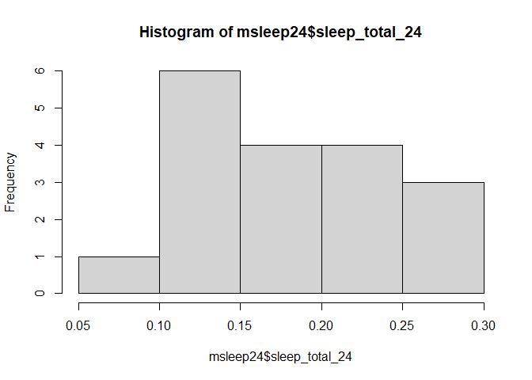

## Learning Goals
*At the end of this exercise, you will be able to:*    
1. Use a combination of `select()`, `filter()`, and `mutate()` to transform data frames.  
2. Use the `skimr` package to produce summaries of data.  
3. Produce clean summaries of data using `summarize()`.  
4. Use `group_by()` in combination with `summarize()` to produce grouped summaries of data.  

## Review
At this point, you should be comfortable using the functions of `dplyr`. If you need extra help, please [email me](mailto: jmledford@ucdavis.edu).  

## Package updates
In order to use some of the new function in the second part of lab today, you need to update your installed R packages. Please navigate to `Tools` >`Check for Package Updates...`. Follow the directions to update the packages.  

## Load the tidyverse and janitor

```r
library("tidyverse")
library("janitor")
```

## Install `skimr`

```r
#install.packages("skimr")
library("skimr")
```

## Load the data
For this lab, we will use the built-in data on mammal sleep patterns. From: _V. M. Savage and G. B. West. A quantitative, theoretical framework for understanding mammalian sleep. Proceedings of the National Academy of Sciences, 104 (3):1051-1056, 2007_.

```r
?msleep
```

```
## starting httpd help server ... done
```

```r
names(msleep)
```

```
##  [1] "name"         "genus"        "vore"         "order"        "conservation"
##  [6] "sleep_total"  "sleep_rem"    "sleep_cycle"  "awake"        "brainwt"     
## [11] "bodywt"
```

We will also use the awesome [palmerpenguins](https://allisonhorst.github.io/palmerpenguins/articles/intro.html) data in the second part of lab so let's install it now.

```r
remotes::install_github("allisonhorst/palmerpenguins")
```

```
## Downloading GitHub repo allisonhorst/palmerpenguins@HEAD
```

```
## Running `R CMD build`...
```

```
## * checking for file 'C:\Users\ujm71\AppData\Local\Temp\RtmpiKVfBi\remotes292846a6e36d0\allisonhorst-palmerpenguins-6953027/DESCRIPTION' ... OK
## * preparing 'palmerpenguins':
## * checking DESCRIPTION meta-information ... OK
## * checking for LF line-endings in source and make files and shell scripts
## * checking for empty or unneeded directories
## * building 'palmerpenguins_0.1.0.tar.gz'
```

```
## 'C:/bis15folder/rpkgs'의 위치에 패키지(들)을 설치합니다.
## (왜냐하면 'lib'가 지정되지 않았기 때문입니다)
```


```r
dim(msleep)
```

```
## [1] 83 11
```


```r
summary(msleep)
```

```
##      name              genus               vore              order          
##  Length:83          Length:83          Length:83          Length:83         
##  Class :character   Class :character   Class :character   Class :character  
##  Mode  :character   Mode  :character   Mode  :character   Mode  :character  
##                                                                             
##                                                                             
##                                                                             
##                                                                             
##  conservation        sleep_total      sleep_rem      sleep_cycle    
##  Length:83          Min.   : 1.90   Min.   :0.100   Min.   :0.1167  
##  Class :character   1st Qu.: 7.85   1st Qu.:0.900   1st Qu.:0.1833  
##  Mode  :character   Median :10.10   Median :1.500   Median :0.3333  
##                     Mean   :10.43   Mean   :1.875   Mean   :0.4396  
##                     3rd Qu.:13.75   3rd Qu.:2.400   3rd Qu.:0.5792  
##                     Max.   :19.90   Max.   :6.600   Max.   :1.5000  
##                                     NA's   :22      NA's   :51      
##      awake          brainwt            bodywt        
##  Min.   : 4.10   Min.   :0.00014   Min.   :   0.005  
##  1st Qu.:10.25   1st Qu.:0.00290   1st Qu.:   0.174  
##  Median :13.90   Median :0.01240   Median :   1.670  
##  Mean   :13.57   Mean   :0.28158   Mean   : 166.136  
##  3rd Qu.:16.15   3rd Qu.:0.12550   3rd Qu.:  41.750  
##  Max.   :22.10   Max.   :5.71200   Max.   :6654.000  
##                  NA's   :27
```

```r
glimpse(msleep)
```

```
## Rows: 83
## Columns: 11
## $ name         <chr> "Cheetah", "Owl monkey", "Mountain beaver", "Greater shor~
## $ genus        <chr> "Acinonyx", "Aotus", "Aplodontia", "Blarina", "Bos", "Bra~
## $ vore         <chr> "carni", "omni", "herbi", "omni", "herbi", "herbi", "carn~
## $ order        <chr> "Carnivora", "Primates", "Rodentia", "Soricomorpha", "Art~
## $ conservation <chr> "lc", NA, "nt", "lc", "domesticated", NA, "vu", NA, "dome~
## $ sleep_total  <dbl> 12.1, 17.0, 14.4, 14.9, 4.0, 14.4, 8.7, 7.0, 10.1, 3.0, 5~
## $ sleep_rem    <dbl> NA, 1.8, 2.4, 2.3, 0.7, 2.2, 1.4, NA, 2.9, NA, 0.6, 0.8, ~
## $ sleep_cycle  <dbl> NA, NA, NA, 0.1333333, 0.6666667, 0.7666667, 0.3833333, N~
## $ awake        <dbl> 11.9, 7.0, 9.6, 9.1, 20.0, 9.6, 15.3, 17.0, 13.9, 21.0, 1~
## $ brainwt      <dbl> NA, 0.01550, NA, 0.00029, 0.42300, NA, NA, NA, 0.07000, 0~
## $ bodywt       <dbl> 50.000, 0.480, 1.350, 0.019, 600.000, 3.850, 20.490, 0.04~
```

## dplyr Practice
Let's do a bit more practice to make sure that we understand `select()`, `filter()`, and `mutate()`. Start by building a new data frame `msleep24` from the `msleep` data that: contains the `name` and `vore` variables along with a new column called `sleep_total_24` which is the amount of time a species sleeps expressed as a proportion of a 24-hour day. Remove any rows with NA's and restrict the `sleep_total_24` values to less than 0.3. Arrange the output in descending order.  

```r
msleep24 <- msleep %>% 
  mutate(sleep_total_24=sleep_total/24) %>% 
  select(name, vore, sleep_total_24) %>% 
  filter(!is.na(vore)) %>% 
  filter(sleep_total_24<0.3) %>% 
  arrange(desc(sleep_total_24))
```


```r
msleep24
```

```
## # A tibble: 18 x 3
##    name                 vore  sleep_total_24
##    <chr>                <chr>          <dbl>
##  1 Gray hyrax           herbi         0.262 
##  2 Genet                carni         0.262 
##  3 Gray seal            carni         0.258 
##  4 Common porpoise      carni         0.233 
##  5 Goat                 herbi         0.221 
##  6 Tree hyrax           herbi         0.221 
##  7 Bottle-nosed dolphin carni         0.217 
##  8 Brazilian tapir      herbi         0.183 
##  9 Cow                  herbi         0.167 
## 10 Asian elephant       herbi         0.162 
## 11 Sheep                herbi         0.158 
## 12 Caspian seal         carni         0.146 
## 13 African elephant     herbi         0.137 
## 14 Donkey               herbi         0.129 
## 15 Roe deer             herbi         0.125 
## 16 Horse                herbi         0.121 
## 17 Pilot whale          carni         0.112 
## 18 Giraffe              herbi         0.0792
```

Did `dplyr` do what we expected? How do we check our output? Remember, just because your code runs it doesn't mean that it did what you intended.

```r
summary(msleep24)
```

```
##      name               vore           sleep_total_24   
##  Length:18          Length:18          Min.   :0.07917  
##  Class :character   Class :character   1st Qu.:0.13125  
##  Mode  :character   Mode  :character   Median :0.16458  
##                                        Mean   :0.17755  
##                                        3rd Qu.:0.22083  
##                                        Max.   :0.26250
```

Try out the new function `skim()` as part of the `skimr` package.

```r
skim(msleep24)
```


Table: Data summary

|                         |         |
|:------------------------|:--------|
|Name                     |msleep24 |
|Number of rows           |18       |
|Number of columns        |3        |
|_______________________  |         |
|Column type frequency:   |         |
|character                |2        |
|numeric                  |1        |
|________________________ |         |
|Group variables          |None     |


**Variable type: character**

|skim_variable | n_missing| complete_rate| min| max| empty| n_unique| whitespace|
|:-------------|---------:|-------------:|---:|---:|-----:|--------:|----------:|
|name          |         0|             1|   3|  20|     0|       18|          0|
|vore          |         0|             1|   5|   5|     0|        2|          0|


**Variable type: numeric**

|skim_variable  | n_missing| complete_rate| mean|   sd|   p0|  p25|  p50|  p75| p100|hist                                     |
|:--------------|---------:|-------------:|----:|----:|----:|----:|----:|----:|----:|:----------------------------------------|
|sleep_total_24 |         0|             1| 0.18| 0.06| 0.08| 0.13| 0.16| 0.22| 0.26|▃▇▆▅▆ |

Histograms are also a quick way to check the output.

```r
hist(msleep24$sleep_total_24)
```

<!-- -->

Don't forget we can also use `tabyl()` across one or many variables.

```r
msleep24 %>% 
  tabyl(vore) %>% 
  adorn_pct_formatting(digits=1)
```

```
##   vore  n percent
##  carni  6   33.3%
##  herbi 12   66.7%
```

## Practice
1. Which taxonomic orders have species that belong to more than one class of `vore`?

```r
msleep
```

```
## # A tibble: 83 x 11
##    name   genus vore  order conservation sleep_total sleep_rem sleep_cycle awake
##    <chr>  <chr> <chr> <chr> <chr>              <dbl>     <dbl>       <dbl> <dbl>
##  1 Cheet~ Acin~ carni Carn~ lc                  12.1      NA        NA      11.9
##  2 Owl m~ Aotus omni  Prim~ <NA>                17         1.8      NA       7  
##  3 Mount~ Aplo~ herbi Rode~ nt                  14.4       2.4      NA       9.6
##  4 Great~ Blar~ omni  Sori~ lc                  14.9       2.3       0.133   9.1
##  5 Cow    Bos   herbi Arti~ domesticated         4         0.7       0.667  20  
##  6 Three~ Brad~ herbi Pilo~ <NA>                14.4       2.2       0.767   9.6
##  7 North~ Call~ carni Carn~ vu                   8.7       1.4       0.383  15.3
##  8 Vespe~ Calo~ <NA>  Rode~ <NA>                 7        NA        NA      17  
##  9 Dog    Canis carni Carn~ domesticated        10.1       2.9       0.333  13.9
## 10 Roe d~ Capr~ herbi Arti~ lc                   3        NA        NA      21  
## # ... with 73 more rows, and 2 more variables: brainwt <dbl>, bodywt <dbl>
```


```r
msleep%>%
  select(name,vore,order)%>%
  arrange(order)
```

```
## # A tibble: 83 x 3
##    name              vore  order       
##    <chr>             <chr> <chr>       
##  1 Tenrec            omni  Afrosoricida
##  2 Cow               herbi Artiodactyla
##  3 Roe deer          herbi Artiodactyla
##  4 Goat              herbi Artiodactyla
##  5 Giraffe           herbi Artiodactyla
##  6 Sheep             herbi Artiodactyla
##  7 Pig               omni  Artiodactyla
##  8 Cheetah           carni Carnivora   
##  9 Northern fur seal carni Carnivora   
## 10 Dog               carni Carnivora   
## # ... with 73 more rows
```


```r
msleep%>%
  tabyl(order,vore)
```

```
##            order carni herbi insecti omni NA_
##     Afrosoricida     0     0       0    1   0
##     Artiodactyla     0     5       0    1   0
##        Carnivora    12     0       0    0   0
##          Cetacea     3     0       0    0   0
##       Chiroptera     0     0       2    0   0
##        Cingulata     1     0       1    0   0
##  Didelphimorphia     1     0       0    1   0
##    Diprotodontia     0     1       0    0   1
##   Erinaceomorpha     0     0       0    1   1
##       Hyracoidea     0     2       0    0   1
##       Lagomorpha     0     1       0    0   0
##      Monotremata     0     0       1    0   0
##   Perissodactyla     0     3       0    0   0
##           Pilosa     0     1       0    0   0
##         Primates     1     1       0   10   0
##      Proboscidea     0     2       0    0   0
##         Rodentia     1    16       0    2   3
##       Scandentia     0     0       0    1   0
##     Soricomorpha     0     0       1    3   1
```

```r
msleep%>%
  tabyl(vore,order)
```

```
##     vore Afrosoricida Artiodactyla Carnivora Cetacea Chiroptera Cingulata
##    carni            0            0        12       3          0         1
##    herbi            0            5         0       0          0         0
##  insecti            0            0         0       0          2         1
##     omni            1            1         0       0          0         0
##     <NA>            0            0         0       0          0         0
##  Didelphimorphia Diprotodontia Erinaceomorpha Hyracoidea Lagomorpha Monotremata
##                1             0              0          0          0           0
##                0             1              0          2          1           0
##                0             0              0          0          0           1
##                1             0              1          0          0           0
##                0             1              1          1          0           0
##  Perissodactyla Pilosa Primates Proboscidea Rodentia Scandentia Soricomorpha
##               0      0        1           0        1          0            0
##               3      1        1           2       16          0            0
##               0      0        0           0        0          0            1
##               0      0       10           0        2          1            3
##               0      0        0           0        3          0            1
```


```r
msleep%>%
  filter(!is.na(vore))%>%
  tabyl(order,vore)
```

```
##            order carni herbi insecti omni
##     Afrosoricida     0     0       0    1
##     Artiodactyla     0     5       0    1
##        Carnivora    12     0       0    0
##          Cetacea     3     0       0    0
##       Chiroptera     0     0       2    0
##        Cingulata     1     0       1    0
##  Didelphimorphia     1     0       0    1
##    Diprotodontia     0     1       0    0
##   Erinaceomorpha     0     0       0    1
##       Hyracoidea     0     2       0    0
##       Lagomorpha     0     1       0    0
##      Monotremata     0     0       1    0
##   Perissodactyla     0     3       0    0
##           Pilosa     0     1       0    0
##         Primates     1     1       0   10
##      Proboscidea     0     2       0    0
##         Rodentia     1    16       0    2
##       Scandentia     0     0       0    1
##     Soricomorpha     0     0       1    3
```

## `summarize()`
`summarize()` will produce summary statistics for a given variable in a data frame. For example, if you are asked to calculate the mean of `sleep_total` for large and small mammals you could do this using a combination of commands, but it isn't very efficient or clean. We can do better!  

```r
head(msleep)
```

```
## # A tibble: 6 x 11
##   name    genus vore  order conservation sleep_total sleep_rem sleep_cycle awake
##   <chr>   <chr> <chr> <chr> <chr>              <dbl>     <dbl>       <dbl> <dbl>
## 1 Cheetah Acin~ carni Carn~ lc                  12.1      NA        NA      11.9
## 2 Owl mo~ Aotus omni  Prim~ <NA>                17         1.8      NA       7  
## 3 Mounta~ Aplo~ herbi Rode~ nt                  14.4       2.4      NA       9.6
## 4 Greate~ Blar~ omni  Sori~ lc                  14.9       2.3       0.133   9.1
## 5 Cow     Bos   herbi Arti~ domesticated         4         0.7       0.667  20  
## 6 Three-~ Brad~ herbi Pilo~ <NA>                14.4       2.2       0.767   9.6
## # ... with 2 more variables: brainwt <dbl>, bodywt <dbl>
```

For example, if we define "large" as having a `bodywt` greater than 200 then we get the following:

```r
large <- 
  msleep %>% 
  select(name, genus, bodywt, sleep_total) %>% 
  filter(bodywt > 200) %>% 
  arrange(desc(bodywt))
large
```

```
## # A tibble: 7 x 4
##   name             genus         bodywt sleep_total
##   <chr>            <chr>          <dbl>       <dbl>
## 1 African elephant Loxodonta      6654          3.3
## 2 Asian elephant   Elephas        2547          3.9
## 3 Giraffe          Giraffa         900.         1.9
## 4 Pilot whale      Globicephalus   800          2.7
## 5 Cow              Bos             600          4  
## 6 Horse            Equus           521          2.9
## 7 Brazilian tapir  Tapirus         208.         4.4
```


```r
mean(large$sleep_total)
```

```
## [1] 3.3
```

We can accomplish the same task using the `summarize()` function to make things cleaner.

```r
msleep %>% 
  filter(bodywt > 200) %>% #large mammals
  summarize(mean_sleep_lg = mean(sleep_total))
```

```
## # A tibble: 1 x 1
##   mean_sleep_lg
##           <dbl>
## 1           3.3
```

You can also combine functions to make useful summaries for multiple variables.

```r
msleep %>% 
    filter(bodywt > 200) %>% 
    summarize(mean_sleep_lg = mean(sleep_total), 
              min_sleep_lg = min(sleep_total),
              max_sleep_lg = max(sleep_total),
              total = n())
```

```
## # A tibble: 1 x 4
##   mean_sleep_lg min_sleep_lg max_sleep_lg total
##           <dbl>        <dbl>        <dbl> <int>
## 1           3.3          1.9          4.4     7
```

## Practice
1. What is the mean, min, and max `bodywt` for the taxonomic order Primates? Provide the total number of observations.

```r
msleep%>%
  filter(order=="Primates")%>%
  summarise(mean_p=mean(bodywt),
            min_p=min(bodywt),
            max_p=max(bodywt),
            total=n())
```

```
## # A tibble: 1 x 4
##   mean_p min_p max_p total
##    <dbl> <dbl> <dbl> <int>
## 1   13.9   0.2    62    12
```

`n_distinct()` is a very handy way of cleanly presenting the number of distinct observations. Here we show the number of distinct genera over 100 in body weight.

```r
msleep %>% 
  filter(bodywt > 100) %>% 
  summarise(n_genera=n_distinct(genus))
```

```
## # A tibble: 1 x 1
##   n_genera
##      <int>
## 1        9
```

There are many other useful summary statistics, depending on your needs: sd(), min(), max(), median(), sum(), n() (returns the length of a column), first() (returns first value in a column), last() (returns last value in a column) and n_distinct() (number of distinct values in a column).

## Practice
1. How many genera are represented in the msleep data frame?
83


```r
msleep%>%
  summarise(n_genera=n_distinct(genus))
```

```
## # A tibble: 1 x 1
##   n_genera
##      <int>
## 1       77
```

2. What are the min, max, and mean `sleep_total` for all of the mammals? Be sure to include the total n.

```r
msleep%>%
  select(sleep_total)%>%
  summarize(min_sleep_t=min(sleep_total),
            max_sleep_t=max(sleep_total),
            mean_sleep_t=mean(sleep_total),
            total_sleep_t=n())
```

```
## # A tibble: 1 x 4
##   min_sleep_t max_sleep_t mean_sleep_t total_sleep_t
##         <dbl>       <dbl>        <dbl>         <int>
## 1         1.9        19.9         10.4            83
```

## `group_by()`
The `summarize()` function is most useful when used in conjunction with `group_by()`. Although producing a summary of body weight for all of the mammals in the data set is helpful, what if we were interested in body weight by feeding ecology?

```r
msleep %>%
  group_by(vore) %>% #we are grouping by feeding ecology
  summarize(min_bodywt = min(bodywt),
            max_bodywt = max(bodywt),
            mean_bodywt = mean(bodywt),
            total=n())
```

```
## # A tibble: 5 x 5
##   vore    min_bodywt max_bodywt mean_bodywt total
##   <chr>        <dbl>      <dbl>       <dbl> <int>
## 1 carni        0.028      800        90.8      19
## 2 herbi        0.022     6654       367.       32
## 3 insecti      0.01        60        12.9       5
## 4 omni         0.005       86.2      12.7      20
## 5 <NA>         0.021        3.6       0.858     7
```

## Practice
1. Calculate mean brain weight by taxonomic order in the msleep data.

```r
msleep
```

```
## # A tibble: 83 x 11
##    name   genus vore  order conservation sleep_total sleep_rem sleep_cycle awake
##    <chr>  <chr> <chr> <chr> <chr>              <dbl>     <dbl>       <dbl> <dbl>
##  1 Cheet~ Acin~ carni Carn~ lc                  12.1      NA        NA      11.9
##  2 Owl m~ Aotus omni  Prim~ <NA>                17         1.8      NA       7  
##  3 Mount~ Aplo~ herbi Rode~ nt                  14.4       2.4      NA       9.6
##  4 Great~ Blar~ omni  Sori~ lc                  14.9       2.3       0.133   9.1
##  5 Cow    Bos   herbi Arti~ domesticated         4         0.7       0.667  20  
##  6 Three~ Brad~ herbi Pilo~ <NA>                14.4       2.2       0.767   9.6
##  7 North~ Call~ carni Carn~ vu                   8.7       1.4       0.383  15.3
##  8 Vespe~ Calo~ <NA>  Rode~ <NA>                 7        NA        NA      17  
##  9 Dog    Canis carni Carn~ domesticated        10.1       2.9       0.333  13.9
## 10 Roe d~ Capr~ herbi Arti~ lc                   3        NA        NA      21  
## # ... with 73 more rows, and 2 more variables: brainwt <dbl>, bodywt <dbl>
```


```r
msleep%>%
  group_by(order)%>%
  summarize(mean_bw=mean(brainwt))
```

```
## # A tibble: 19 x 2
##    order             mean_bw
##    <chr>               <dbl>
##  1 Afrosoricida     0.0026  
##  2 Artiodactyla    NA       
##  3 Carnivora       NA       
##  4 Cetacea         NA       
##  5 Chiroptera       0.000275
##  6 Cingulata        0.0459  
##  7 Didelphimorphia NA       
##  8 Diprotodontia   NA       
##  9 Erinaceomorpha   0.00295 
## 10 Hyracoidea       0.0152  
## 11 Lagomorpha       0.0121  
## 12 Monotremata      0.025   
## 13 Perissodactyla   0.414   
## 14 Pilosa          NA       
## 15 Primates        NA       
## 16 Proboscidea      5.16    
## 17 Rodentia        NA       
## 18 Scandentia       0.0025  
## 19 Soricomorpha     0.000592
```

2. What does `NA` mean? How are NA's being treated by the summarize function?

```r
msleep%>%
  filter(order=="Carnivora")%>%
  select(order,genus,brainwt)
```

```
## # A tibble: 12 x 3
##    order     genus        brainwt
##    <chr>     <chr>          <dbl>
##  1 Carnivora Acinonyx     NA     
##  2 Carnivora Callorhinus  NA     
##  3 Carnivora Canis         0.07  
##  4 Carnivora Felis         0.0256
##  5 Carnivora Haliochoerus  0.325 
##  6 Carnivora Panthera     NA     
##  7 Carnivora Panthera      0.157 
##  8 Carnivora Panthera     NA     
##  9 Carnivora Phoca        NA     
## 10 Carnivora Genetta       0.0175
## 11 Carnivora Vulpes        0.0445
## 12 Carnivora Vulpes        0.0504
```

3. Try running the code again, but this time add `na.rm=TRUE`. What is the problem with Cetacea? Compare this to Carnivora. 

```r
msleep%>%
  group_by(order)%>%
  summarize(mean_bw=mean(brainwt,na.rm=TRUE))
```

```
## # A tibble: 19 x 2
##    order              mean_bw
##    <chr>                <dbl>
##  1 Afrosoricida      0.0026  
##  2 Artiodactyla      0.198   
##  3 Carnivora         0.0986  
##  4 Cetacea         NaN       
##  5 Chiroptera        0.000275
##  6 Cingulata         0.0459  
##  7 Didelphimorphia   0.0063  
##  8 Diprotodontia     0.0114  
##  9 Erinaceomorpha    0.00295 
## 10 Hyracoidea        0.0152  
## 11 Lagomorpha        0.0121  
## 12 Monotremata       0.025   
## 13 Perissodactyla    0.414   
## 14 Pilosa          NaN       
## 15 Primates          0.254   
## 16 Proboscidea       5.16    
## 17 Rodentia          0.00357 
## 18 Scandentia        0.0025  
## 19 Soricomorpha      0.000592
```

## That's it! Take a break and I will see you on Zoom!  

-->[Home](https://jmledford3115.github.io/datascibiol/)  
