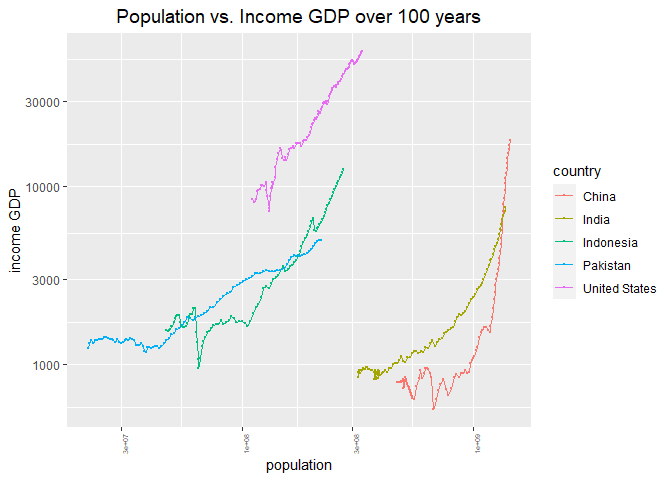

```r
library(tidyverse)
library(janitor)
library(here)
library(naniar)
```

## Instructions
Answer the following questions and complete the exercises in RMarkdown. Please embed all of your code and push your final work to your repository. Your code should be organized, clean, and run free from errors. Be sure to **add your name** to the author header above. You may use any resources to answer these questions (including each other), but you may not post questions to Open Stacks or external help sites. There are 10 total questions.  

Make sure to use the formatting conventions of RMarkdown to make your report neat and clean! Your plots should use consistent aesthetics throughout.  

This exam is due by **12:00p on Tuesday, February 22**.  

## Gapminder
For this assignment, we are going to use data from  [gapminder](https://www.gapminder.org/). Gapminder includes information about economics, population, social issues, and life expectancy from countries all over the world. We will use three data sets, so please load all three as separate objects.    

1. population_total.csv  
2. income_per_person_gdppercapita_ppp_inflation_adjusted.csv  
3. life_expectancy_years.csv  

```r
population<-readr::read_csv("data/population_total.csv")
```

```
## Rows: 195 Columns: 302
## -- Column specification --------------------------------------------------------
## Delimiter: ","
## chr   (1): country
## dbl (301): 1800, 1801, 1802, 1803, 1804, 1805, 1806, 1807, 1808, 1809, 1810,...
## 
## i Use `spec()` to retrieve the full column specification for this data.
## i Specify the column types or set `show_col_types = FALSE` to quiet this message.
```

```r
income_gdp<-readr::read_csv("data/income_per_person_gdppercapita_ppp_inflation_adjusted.csv")
```

```
## Rows: 193 Columns: 242
## -- Column specification --------------------------------------------------------
## Delimiter: ","
## chr   (1): country
## dbl (241): 1800, 1801, 1802, 1803, 1804, 1805, 1806, 1807, 1808, 1809, 1810,...
## 
## i Use `spec()` to retrieve the full column specification for this data.
## i Specify the column types or set `show_col_types = FALSE` to quiet this message.
```

```r
life_exp<-readr::read_csv("data/life_expectancy_years.csv")
```

```
## Rows: 187 Columns: 302
## -- Column specification --------------------------------------------------------
## Delimiter: ","
## chr   (1): country
## dbl (301): 1800, 1801, 1802, 1803, 1804, 1805, 1806, 1807, 1808, 1809, 1810,...
## 
## i Use `spec()` to retrieve the full column specification for this data.
## i Specify the column types or set `show_col_types = FALSE` to quiet this message.
```

```r
summary(population)
```

```
##    country               1800                1801                1802          
##  Length:195         Min.   :      905   Min.   :      905   Min.   :      905  
##  Class :character   1st Qu.:   128500   1st Qu.:   128500   1st Qu.:   128500  
##  Mode  :character   Median :   637000   Median :   637000   Median :   637000  
##                     Mean   :  5038229   Mean   :  5055872   Mean   :  5074643  
##                     3rd Qu.:  2200000   3rd Qu.:  2200000   3rd Qu.:  2195000  
##                     Max.   :330000000   Max.   :332000000   Max.   :333000000  
##       1803                1804                1805          
##  Min.   :      905   Min.   :      905   Min.   :      905  
##  1st Qu.:   129000   1st Qu.:   129000   1st Qu.:   129000  
##  Median :   637000   Median :   637000   Median :   637000  
##  Mean   :  5092072   Mean   :  5105055   Mean   :  5128710  
##  3rd Qu.:  2195000   3rd Qu.:  2195000   3rd Qu.:  2175000  
##  Max.   :335000000   Max.   :336000000   Max.   :338000000  
##       1806                1807                1808          
##  Min.   :      905   Min.   :      905   Min.   :      905  
##  1st Qu.:   127500   1st Qu.:   127000   1st Qu.:   127000  
##  Median :   637000   Median :   637000   Median :   637000  
##  Mean   :  5143516   Mean   :  5167424   Mean   :  5186405  
##  3rd Qu.:  2145000   3rd Qu.:  2145000   3rd Qu.:  2145000  
##  Max.   :339000000   Max.   :341000000   Max.   :343000000  
##       1809                1810                1811          
##  Min.   :      905   Min.   :      905   Min.   :      905  
##  1st Qu.:   127000   1st Qu.:   127000   1st Qu.:   127000  
##  Median :   637000   Median :   639000   Median :   655000  
##  Mean   :  5199982   Mean   :  5232967   Mean   :  5254824  
##  3rd Qu.:  2145000   3rd Qu.:  2145000   3rd Qu.:  2145000  
##  Max.   :344000000   Max.   :347000000   Max.   :349000000  
##       1812                1813                1814          
##  Min.   :      905   Min.   :      905   Min.   :      905  
##  1st Qu.:   127000   1st Qu.:   127000   1st Qu.:   125000  
##  Median :   671000   Median :   688000   Median :   705000  
##  Mean   :  5294767   Mean   :  5325674   Mean   :  5361654  
##  3rd Qu.:  2145000   3rd Qu.:  2145000   3rd Qu.:  2155000  
##  Max.   :353000000   Max.   :356000000   Max.   :359000000  
##       1815                1816                1817          
##  Min.   :      905   Min.   :      905   Min.   :      905  
##  1st Qu.:   123000   1st Qu.:   121000   1st Qu.:   120000  
##  Median :   713000   Median :   713000   Median :   713000  
##  Mean   :  5398080   Mean   :  5440271   Mean   :  5472701  
##  3rd Qu.:  2170000   3rd Qu.:  2165000   3rd Qu.:  2155000  
##  Max.   :363000000   Max.   :367000000   Max.   :370000000  
##       1818                1819               1820                1821          
##  Min.   :      905   Min.   :9.05e+02   Min.   :      905   Min.   :      905  
##  1st Qu.:   120000   1st Qu.:1.20e+05   1st Qu.:   120000   1st Qu.:   120500  
##  Median :   713000   Median :7.14e+05   Median :   719000   Median :   728000  
##  Mean   :  5517194   Mean   :5.55e+06   Mean   :  5588640   Mean   :  5627718  
##  3rd Qu.:  2145000   3rd Qu.:2.15e+06   3rd Qu.:  2165000   3rd Qu.:  2185000  
##  Max.   :374000000   Max.   :3.77e+08   Max.   :380000000   Max.   :384000000  
##       1822                1823                1824          
##  Min.   :      905   Min.   :      905   Min.   :      905  
##  1st Qu.:   121000   1st Qu.:   122000   1st Qu.:   122500  
##  Median :   736000   Median :   742000   Median :   749000  
##  Mean   :  5661860   Mean   :  5701340   Mean   :  5734966  
##  3rd Qu.:  2215000   3rd Qu.:  2250000   3rd Qu.:  2285000  
##  Max.   :386000000   Max.   :389000000   Max.   :392000000  
##       1825                1826                1827          
##  Min.   :      905   Min.   :      905   Min.   :      905  
##  1st Qu.:   123000   1st Qu.:   123500   1st Qu.:   123000  
##  Median :   756000   Median :   762000   Median :   768000  
##  Mean   :  5774826   Mean   :  5816081   Mean   :  5853201  
##  3rd Qu.:  2310000   3rd Qu.:  2335000   3rd Qu.:  2370000  
##  Max.   :395000000   Max.   :398000000   Max.   :400000000  
##       1828                1829                1830                1831         
##  Min.   :      905   Min.   :      905   Min.   :      905   Min.   :9.05e+02  
##  1st Qu.:   122000   1st Qu.:   119500   1st Qu.:   118000   1st Qu.:1.16e+05  
##  Median :   775000   Median :   782000   Median :   789000   Median :7.89e+05  
##  Mean   :  5894272   Mean   :  5936815   Mean   :  5967640   Mean   :6.00e+06  
##  3rd Qu.:  2395000   3rd Qu.:  2420000   3rd Qu.:  2445000   3rd Qu.:2.47e+06  
##  Max.   :403000000   Max.   :406000000   Max.   :407000000   Max.   :4.09e+08  
##       1832                1833                1834          
##  Min.   :      905   Min.   :      905   Min.   :      905  
##  1st Qu.:   115000   1st Qu.:   114000   1st Qu.:   113500  
##  Median :   795000   Median :   802000   Median :   810000  
##  Mean   :  6031314   Mean   :  6057897   Mean   :  6086100  
##  3rd Qu.:  2495000   3rd Qu.:  2520000   3rd Qu.:  2550000  
##  Max.   :410000000   Max.   :410000000   Max.   :410000000  
##       1835                1836                1837          
##  Min.   :      905   Min.   :      905   Min.   :      905  
##  1st Qu.:   113000   1st Qu.:   112500   1st Qu.:   113500  
##  Median :   817000   Median :   825000   Median :   823000  
##  Mean   :  6113028   Mean   :  6146867   Mean   :  6174688  
##  3rd Qu.:  2570000   3rd Qu.:  2595000   3rd Qu.:  2610000  
##  Max.   :410000000   Max.   :411000000   Max.   :411000000  
##       1838                1839                1840          
##  Min.   :      905   Min.   :      905   Min.   :      905  
##  1st Qu.:   115500   1st Qu.:   117500   1st Qu.:   120500  
##  Median :   810000   Median :   805000   Median :   818000  
##  Mean   :  6203668   Mean   :  6236324   Mean   :  6265864  
##  3rd Qu.:  2630000   3rd Qu.:  2645000   3rd Qu.:  2665000  
##  Max.   :411000000   Max.   :412000000   Max.   :412000000  
##       1841                1842                1843          
##  Min.   :      905   Min.   :      905   Min.   :      905  
##  1st Qu.:   123500   1st Qu.:   127000   1st Qu.:   129500  
##  Median :   831000   Median :   845000   Median :   859000  
##  Mean   :  6288498   Mean   :  6316663   Mean   :  6344308  
##  3rd Qu.:  2680000   3rd Qu.:  2700000   3rd Qu.:  2715000  
##  Max.   :412000000   Max.   :412000000   Max.   :412000000  
##       1844                1845                1846          
##  Min.   :      905   Min.   :      905   Min.   :      905  
##  1st Qu.:   129500   1st Qu.:   130000   1st Qu.:   132000  
##  Median :   887000   Median :   895000   Median :   904000  
##  Mean   :  6374099   Mean   :  6402963   Mean   :  6431975  
##  3rd Qu.:  2735000   3rd Qu.:  2755000   3rd Qu.:  2825000  
##  Max.   :412000000   Max.   :412000000   Max.   :412000000  
##       1847                1848                1849          
##  Min.   :      905   Min.   :      905   Min.   :      905  
##  1st Qu.:   133500   1st Qu.:   134500   1st Qu.:   135500  
##  Median :   914000   Median :   922000   Median :   930000  
##  Mean   :  6462558   Mean   :  6492695   Mean   :  6518678  
##  3rd Qu.:  2825000   3rd Qu.:  2860000   3rd Qu.:  2885000  
##  Max.   :412000000   Max.   :412000000   Max.   :411000000  
##       1850                1851                1852          
##  Min.   :      905   Min.   :      905   Min.   :      905  
##  1st Qu.:   136500   1st Qu.:   138500   1st Qu.:   143000  
##  Median :   937000   Median :   946000   Median :   954000  
##  Mean   :  6543826   Mean   :  6560809   Mean   :  6572626  
##  3rd Qu.:  2905000   3rd Qu.:  2925000   3rd Qu.:  2945000  
##  Max.   :410000000   Max.   :408000000   Max.   :405000000  
##       1853                1854                1855          
##  Min.   :      905   Min.   :      905   Min.   :      906  
##  1st Qu.:   148000   1st Qu.:   152500   1st Qu.:   154500  
##  Median :   963000   Median :   972000   Median :   981000  
##  Mean   :  6580616   Mean   :  6593709   Mean   :  6601445  
##  3rd Qu.:  2965000   3rd Qu.:  2975000   3rd Qu.:  2985000  
##  Max.   :401000000   Max.   :398000000   Max.   :394000000  
##       1856                1857                1858          
##  Min.   :      906   Min.   :      906   Min.   :      906  
##  1st Qu.:   156000   1st Qu.:   157500   1st Qu.:   158500  
##  Median :   989000   Median :  1010000   Median :  1020000  
##  Mean   :  6614979   Mean   :  6617604   Mean   :  6633016  
##  3rd Qu.:  3015000   3rd Qu.:  3045000   3rd Qu.:  3075000  
##  Max.   :391000000   Max.   :387000000   Max.   :384000000  
##       1859                1860                1861          
##  Min.   :      906   Min.   :      906   Min.   :      906  
##  1st Qu.:   160000   1st Qu.:   161000   1st Qu.:   162500  
##  Median :  1030000   Median :  1040000   Median :  1040000  
##  Mean   :  6647610   Mean   :  6661632   Mean   :  6682475  
##  3rd Qu.:  3110000   3rd Qu.:  3140000   3rd Qu.:  3175000  
##  Max.   :381000000   Max.   :378000000   Max.   :376000000  
##       1862                1863                1864          
##  Min.   :      906   Min.   :      906   Min.   :      906  
##  1st Qu.:   163500   1st Qu.:   170500   1st Qu.:   178000  
##  Median :  1050000   Median :  1060000   Median :  1060000  
##  Mean   :  6698291   Mean   :  6723903   Mean   :  6745063  
##  3rd Qu.:  3205000   3rd Qu.:  3235000   3rd Qu.:  3270000  
##  Max.   :373000000   Max.   :372000000   Max.   :370000000  
##       1865                1866                1867          
##  Min.   :      907   Min.   :      907   Min.   :      907  
##  1st Qu.:   180500   1st Qu.:   181500   1st Qu.:   182000  
##  Median :  1070000   Median :  1080000   Median :  1090000  
##  Mean   :  6766812   Mean   :  6789713   Mean   :  6811864  
##  3rd Qu.:  3300000   3rd Qu.:  3335000   3rd Qu.:  3370000  
##  Max.   :368000000   Max.   :366000000   Max.   :364000000  
##       1868                1869                1870          
##  Min.   :      907   Min.   :      907   Min.   :      907  
##  1st Qu.:   183000   1st Qu.:   185500   1st Qu.:   188000  
##  Median :  1100000   Median :  1110000   Median :  1120000  
##  Mean   :  6835001   Mean   :  6863545   Mean   :  6893385  
##  3rd Qu.:  3400000   3rd Qu.:  3435000   3rd Qu.:  3470000  
##  Max.   :362000000   Max.   :361000000   Max.   :360000000  
##       1871                1872                1873          
##  Min.   :      907   Min.   :      907   Min.   :      907  
##  1st Qu.:   190500   1st Qu.:   193000   1st Qu.:   193500  
##  Median :  1130000   Median :  1140000   Median :  1150000  
##  Mean   :  6926927   Mean   :  6963235   Mean   :  7003934  
##  3rd Qu.:  3505000   3rd Qu.:  3540000   3rd Qu.:  3575000  
##  Max.   :360000000   Max.   :361000000   Max.   :362000000  
##       1874                1875                1876          
##  Min.   :      908   Min.   :      908   Min.   :      908  
##  1st Qu.:   194000   1st Qu.:   195000   1st Qu.:   196500  
##  Median :  1160000   Median :  1170000   Median :  1190000  
##  Mean   :  7045028   Mean   :  7082339   Mean   :  7123451  
##  3rd Qu.:  3610000   3rd Qu.:  3650000   3rd Qu.:  3680000  
##  Max.   :363000000   Max.   :364000000   Max.   :365000000  
##       1877                1878                1879          
##  Min.   :      908   Min.   :      908   Min.   :      908  
##  1st Qu.:   198000   1st Qu.:   200000   1st Qu.:   201500  
##  Median :  1200000   Median :  1220000   Median :  1220000  
##  Mean   :  7162378   Mean   :  7204484   Mean   :  7248380  
##  3rd Qu.:  3720000   3rd Qu.:  3720000   3rd Qu.:  3745000  
##  Max.   :366000000   Max.   :367000000   Max.   :368000000  
##       1880                1881                1882          
##  Min.   :      908   Min.   :      908   Min.   :      908  
##  1st Qu.:   203500   1st Qu.:   205000   1st Qu.:   206500  
##  Median :  1230000   Median :  1240000   Median :  1250000  
##  Mean   :  7293329   Mean   :  7345366   Mean   :  7395656  
##  3rd Qu.:  3800000   3rd Qu.:  3870000   3rd Qu.:  3910000  
##  Max.   :369000000   Max.   :370000000   Max.   :371000000  
##       1883                1884                1885          
##  Min.   :      908   Min.   :      909   Min.   :      909  
##  1st Qu.:   208500   1st Qu.:   212000   1st Qu.:   215500  
##  Median :  1260000   Median :  1270000   Median :  1300000  
##  Mean   :  7448344   Mean   :  7507391   Mean   :  7565904  
##  3rd Qu.:  3950000   3rd Qu.:  3990000   3rd Qu.:  4030000  
##  Max.   :372000000   Max.   :374000000   Max.   :375000000  
##       1886                1887                1888          
##  Min.   :      909   Min.   :      909   Min.   :      909  
##  1st Qu.:   220500   1st Qu.:   225000   1st Qu.:   230000  
##  Median :  1330000   Median :  1350000   Median :  1370000  
##  Mean   :  7621718   Mean   :  7677260   Mean   :  7743123  
##  3rd Qu.:  4070000   3rd Qu.:  4110000   3rd Qu.:  4150000  
##  Max.   :376000000   Max.   :377000000   Max.   :379000000  
##       1889                1890                1891          
##  Min.   :      909   Min.   :      909   Min.   :      909  
##  1st Qu.:   235000   1st Qu.:   239500   1st Qu.:   242500  
##  Median :  1380000   Median :  1390000   Median :  1390000  
##  Mean   :  7799709   Mean   :  7859939   Mean   :  7911962  
##  3rd Qu.:  4195000   3rd Qu.:  4235000   3rd Qu.:  4275000  
##  Max.   :380000000   Max.   :382000000   Max.   :383000000  
##       1892                1893                1894          
##  Min.   :      909   Min.   :      910   Min.   :      910  
##  1st Qu.:   245500   1st Qu.:   249000   1st Qu.:   253500  
##  Median :  1390000   Median :  1390000   Median :  1400000  
##  Mean   :  7966124   Mean   :  8021656   Mean   :  8073309  
##  3rd Qu.:  4290000   3rd Qu.:  4300000   3rd Qu.:  4315000  
##  Max.   :385000000   Max.   :387000000   Max.   :389000000  
##       1895                1896                1897          
##  Min.   :      910   Min.   :      910   Min.   :      910  
##  1st Qu.:   256500   1st Qu.:   259000   1st Qu.:   262500  
##  Median :  1410000   Median :  1420000   Median :  1430000  
##  Mean   :  8129882   Mean   :  8187026   Mean   :  8239609  
##  3rd Qu.:  4305000   3rd Qu.:  4285000   3rd Qu.:  4295000  
##  Max.   :391000000   Max.   :393000000   Max.   :395000000  
##       1898                1899                1900                1901         
##  Min.   :      910   Min.   :      910   Min.   :      910   Min.   :9.10e+02  
##  1st Qu.:   265000   1st Qu.:   268500   1st Qu.:   271000   1st Qu.:2.71e+05  
##  Median :  1440000   Median :  1460000   Median :  1470000   Median :1.48e+06  
##  Mean   :  8297266   Mean   :  8359438   Mean   :  8425604   Mean   :8.49e+06  
##  3rd Qu.:  4350000   3rd Qu.:  4375000   3rd Qu.:  4350000   3rd Qu.:4.33e+06  
##  Max.   :397000000   Max.   :399000000   Max.   :402000000   Max.   :4.04e+08  
##       1902                1903                1904          
##  Min.   :      910   Min.   :      911   Min.   :      911  
##  1st Qu.:   272000   1st Qu.:   276500   1st Qu.:   281000  
##  Median :  1500000   Median :  1500000   Median :  1520000  
##  Mean   :  8560671   Mean   :  8633293   Mean   :  8710535  
##  3rd Qu.:  4330000   3rd Qu.:  4365000   3rd Qu.:  4405000  
##  Max.   :406000000   Max.   :408000000   Max.   :411000000  
##       1905                1906                1907                1908         
##  Min.   :      911   Min.   :      911   Min.   :      911   Min.   :9.11e+02  
##  1st Qu.:   286000   1st Qu.:   290500   1st Qu.:   292500   1st Qu.:2.97e+05  
##  Median :  1540000   Median :  1550000   Median :  1540000   Median :1.53e+06  
##  Mean   :  8785832   Mean   :  8861704   Mean   :  8943411   Mean   :9.02e+06  
##  3rd Qu.:  4490000   3rd Qu.:  4580000   3rd Qu.:  4670000   3rd Qu.:4.76e+06  
##  Max.   :413000000   Max.   :415000000   Max.   :418000000   Max.   :4.20e+08  
##       1909                1910                1911          
##  Min.   :      911   Min.   :      911   Min.   :      911  
##  1st Qu.:   302500   1st Qu.:   306500   1st Qu.:   305000  
##  Median :  1520000   Median :  1520000   Median :  1520000  
##  Mean   :  9094033   Mean   :  9167826   Mean   :  9235432  
##  3rd Qu.:  4800000   3rd Qu.:  4825000   3rd Qu.:  4850000  
##  Max.   :423000000   Max.   :426000000   Max.   :430000000  
##       1912                1913                1914          
##  Min.   :      912   Min.   :      912   Min.   :      912  
##  1st Qu.:   304000   1st Qu.:   305500   1st Qu.:   306500  
##  Median :  1530000   Median :  1550000   Median :  1570000  
##  Mean   :  9302106   Mean   :  9368667   Mean   :  9432415  
##  3rd Qu.:  4845000   3rd Qu.:  4845000   3rd Qu.:  4845000  
##  Max.   :434000000   Max.   :439000000   Max.   :444000000  
##       1915                1916                1917          
##  Min.   :      912   Min.   :      912   Min.   :      912  
##  1st Qu.:   309000   1st Qu.:   310000   1st Qu.:   310500  
##  Median :  1580000   Median :  1590000   Median :  1600000  
##  Mean   :  9498460   Mean   :  9564826   Mean   :  9630391  
##  3rd Qu.:  4855000   3rd Qu.:  4895000   3rd Qu.:  4945000  
##  Max.   :449000000   Max.   :454000000   Max.   :459000000  
##       1918                1919                1920          
##  Min.   :      912   Min.   :      912   Min.   :      912  
##  1st Qu.:   311500   1st Qu.:   313000   1st Qu.:   315500  
##  Median :  1610000   Median :  1630000   Median :  1640000  
##  Mean   :  9697385   Mean   :  9766291   Mean   :  9843719  
##  3rd Qu.:  5015000   3rd Qu.:  5095000   3rd Qu.:  5180000  
##  Max.   :464000000   Max.   :468000000   Max.   :472000000  
##       1921                1922                1923          
##  Min.   :      912   Min.   :      912   Min.   :      912  
##  1st Qu.:   318000   1st Qu.:   321500   1st Qu.:   325500  
##  Median :  1660000   Median :  1680000   Median :  1710000  
##  Mean   :  9925046   Mean   : 10010265   Mean   : 10093537  
##  3rd Qu.:  5275000   3rd Qu.:  5330000   3rd Qu.:  5375000  
##  Max.   :475000000   Max.   :478000000   Max.   :479000000  
##       1924                1925                1926          
##  Min.   :      912   Min.   :      912   Min.   :      912  
##  1st Qu.:   329000   1st Qu.:   333500   1st Qu.:   337500  
##  Median :  1730000   Median :  1760000   Median :  1780000  
##  Mean   : 10186294   Mean   : 10277638   Mean   : 10361037  
##  3rd Qu.:  5425000   3rd Qu.:  5470000   3rd Qu.:  5515000  
##  Max.   :481000000   Max.   :483000000   Max.   :484000000  
##       1927                1928                1929          
##  Min.   :      912   Min.   :      912   Min.   :      912  
##  1st Qu.:   341000   1st Qu.:   345500   1st Qu.:   350000  
##  Median :  1800000   Median :  1820000   Median :  1840000  
##  Mean   : 10454114   Mean   : 10550466   Mean   : 10651250  
##  3rd Qu.:  5565000   3rd Qu.:  5615000   3rd Qu.:  5695000  
##  Max.   :486000000   Max.   :488000000   Max.   :490000000  
##       1930                1931                1932          
##  Min.   :      912   Min.   :      912   Min.   :      912  
##  1st Qu.:   355500   1st Qu.:   361000   1st Qu.:   367500  
##  Median :  1870000   Median :  1880000   Median :  1920000  
##  Mean   : 10749049   Mean   : 10852892   Mean   : 10964595  
##  3rd Qu.:  5775000   3rd Qu.:  5845000   3rd Qu.:  5915000  
##  Max.   :492000000   Max.   :495000000   Max.   :497000000  
##       1933                1934                1935          
##  Min.   :      912   Min.   :      912   Min.   :      912  
##  1st Qu.:   374500   1st Qu.:   382000   1st Qu.:   389500  
##  Median :  1960000   Median :  1980000   Median :  2010000  
##  Mean   : 11073418   Mean   : 11187659   Mean   : 11301979  
##  3rd Qu.:  5985000   3rd Qu.:  6055000   3rd Qu.:  6125000  
##  Max.   :500000000   Max.   :503000000   Max.   :506000000  
##       1936                1937                1938          
##  Min.   :      912   Min.   :      912   Min.   :      912  
##  1st Qu.:   398500   1st Qu.:   407500   1st Qu.:   413500  
##  Median :  2030000   Median :  2050000   Median :  2080000  
##  Mean   : 11416411   Mean   : 11537737   Mean   : 11656526  
##  3rd Qu.:  6195000   3rd Qu.:  6260000   3rd Qu.:  6320000  
##  Max.   :509000000   Max.   :512000000   Max.   :515000000  
##       1939                1940                1941          
##  Min.   :      912   Min.   :      912   Min.   :      912  
##  1st Qu.:   417500   1st Qu.:   417500   1st Qu.:   416000  
##  Median :  2100000   Median :  2120000   Median :  2140000  
##  Mean   : 11770403   Mean   : 11881916   Mean   : 11982732  
##  3rd Qu.:  6385000   3rd Qu.:  6450000   3rd Qu.:  6545000  
##  Max.   :518000000   Max.   :521000000   Max.   :524000000  
##       1942                1943                1944          
##  Min.   :      912   Min.   :      912   Min.   :      912  
##  1st Qu.:   418500   1st Qu.:   421500   1st Qu.:   424500  
##  Median :  2150000   Median :  2180000   Median :  2220000  
##  Mean   : 12082436   Mean   : 12174120   Mean   : 12261134  
##  3rd Qu.:  6660000   3rd Qu.:  6745000   3rd Qu.:  6815000  
##  Max.   :527000000   Max.   :530000000   Max.   :532000000  
##       1945                1946                1947          
##  Min.   :      912   Min.   :      912   Min.   :      912  
##  1st Qu.:   427500   1st Qu.:   430500   1st Qu.:   430500  
##  Median :  2260000   Median :  2300000   Median :  2350000  
##  Mean   : 12353262   Mean   : 12448431   Mean   : 12544251  
##  3rd Qu.:  6900000   3rd Qu.:  7045000   3rd Qu.:  7140000  
##  Max.   :535000000   Max.   :538000000   Max.   :541000000  
##       1948                1949                1950          
##  Min.   :      912   Min.   :      912   Min.   :      906  
##  1st Qu.:   440000   1st Qu.:   454000   1st Qu.:   464500  
##  Median :  2390000   Median :  2440000   Median :  2480000  
##  Mean   : 12649006   Mean   : 12775571   Mean   : 12935097  
##  3rd Qu.:  7235000   3rd Qu.:  7335000   3rd Qu.:  7450000  
##  Max.   :544000000   Max.   :548000000   Max.   :554000000  
##       1951                1952                1953                1954         
##  Min.   :      883   Min.   :      883   Min.   :      890   Min.   :8.99e+02  
##  1st Qu.:   469000   1st Qu.:   474000   1st Qu.:   479000   1st Qu.:4.84e+05  
##  Median :  2500000   Median :  2530000   Median :  2590000   Median :2.61e+06  
##  Mean   : 13176854   Mean   : 13419535   Mean   : 13657720   Mean   :1.39e+07  
##  3rd Qu.:  7505000   3rd Qu.:  7525000   3rd Qu.:  7555000   3rd Qu.:7.64e+06  
##  Max.   :570000000   Max.   :583000000   Max.   :593000000   Max.   :6.03e+08  
##       1955                1956                1957          
##  Min.   :      900   Min.   :      909   Min.   :      908  
##  1st Qu.:   490000   1st Qu.:   503000   1st Qu.:   517000  
##  Median :  2640000   Median :  2720000   Median :  2810000  
##  Mean   : 14139348   Mean   : 14389681   Mean   : 14652702  
##  3rd Qu.:  7840000   3rd Qu.:  7940000   3rd Qu.:  8005000  
##  Max.   :612000000   Max.   :621000000   Max.   :631000000  
##       1958                1959                1960          
##  Min.   :      905   Min.   :      905   Min.   :      904  
##  1st Qu.:   532000   1st Qu.:   546500   1st Qu.:   562000  
##  Median :  2850000   Median :  2930000   Median :  3000000  
##  Mean   : 14914714   Mean   : 15189836   Mean   : 15473214  
##  3rd Qu.:  8085000   3rd Qu.:  8240000   3rd Qu.:  8400000  
##  Max.   :640000000   Max.   :650000000   Max.   :660000000  
##       1961                1962                1963          
##  Min.   :      904   Min.   :      901   Min.   :      898  
##  1st Qu.:   570500   1st Qu.:   578500   1st Qu.:   585500  
##  Median :  3060000   Median :  3120000   Median :  3180000  
##  Mean   : 15761233   Mean   : 16055951   Mean   : 16363208  
##  3rd Qu.:  8625000   3rd Qu.:  8815000   3rd Qu.:  9010000  
##  Max.   :671000000   Max.   :682000000   Max.   :694000000  
##       1964                1965                1966          
##  Min.   :      877   Min.   :      853   Min.   :      814  
##  1st Qu.:   594000   1st Qu.:   603000   1st Qu.:   613500  
##  Median :  3250000   Median :  3310000   Median :  3370000  
##  Mean   : 16680203   Mean   : 17017910   Mean   : 17363647  
##  3rd Qu.:  9310000   3rd Qu.:  9530000   3rd Qu.:  9805000  
##  Max.   :708000000   Max.   :724000000   Max.   :742000000  
##       1967                1968                1969          
##  Min.   :      766   Min.   :      711   Min.   :      670  
##  1st Qu.:   625500   1st Qu.:   656500   1st Qu.:   690500  
##  Median :  3430000   Median :  3500000   Median :  3580000  
##  Mean   : 17727175   Mean   : 18098461   Mean   : 18469813  
##  3rd Qu.:  9910000   3rd Qu.: 10055000   3rd Qu.: 10125000  
##  Max.   :763000000   Max.   :784000000   Max.   :806000000  
##       1970                1971                1972          
##  Min.   :      649   Min.   :      645   Min.   :      661  
##  1st Qu.:   705000   1st Qu.:   716000   1st Qu.:   727500  
##  Median :  3670000   Median :  3770000   Median :  3850000  
##  Mean   : 18858702   Mean   : 19236839   Mean   : 19622929  
##  3rd Qu.: 10350000   3rd Qu.: 10500000   3rd Qu.: 10800000  
##  Max.   :828000000   Max.   :849000000   Max.   :869000000  
##       1973                1974               1975                1976          
##  Min.   :      685   Min.   :7.08e+02   Min.   :      724   Min.   :      730  
##  1st Qu.:   738000   1st Qu.:7.48e+05   1st Qu.:   756000   1st Qu.:   770000  
##  Median :  3910000   Median :3.99e+06   Median :  4010000   Median :  4170000  
##  Mean   : 20008507   Mean   :2.04e+07   Mean   : 20785836   Mean   : 21176135  
##  3rd Qu.: 11150000   3rd Qu.:1.15e+07   3rd Qu.: 11900000   3rd Qu.: 12300000  
##  Max.   :889000000   Max.   :9.08e+08   Max.   :926000000   Max.   :943000000  
##       1977                1978                1979          
##  Min.   :      730   Min.   :      725   Min.   :      722  
##  1st Qu.:   786500   1st Qu.:   833500   1st Qu.:   898500  
##  Median :  4260000   Median :  4340000   Median :  4420000  
##  Mean   : 21543941   Mean   : 21927694   Mean   : 22317685  
##  3rd Qu.: 12650000   3rd Qu.: 13000000   3rd Qu.: 13350000  
##  Max.   :958000000   Max.   :972000000   Max.   :986000000  
##       1980                1981               1982                1983          
##  Min.   :7.250e+02   Min.   :7.23e+02   Min.   :7.250e+02   Min.   :7.300e+02  
##  1st Qu.:9.320e+05   1st Qu.:9.54e+05   1st Qu.:9.760e+05   1st Qu.:9.975e+05  
##  Median :4.510e+06   Median :4.62e+06   Median :4.720e+06   Median :4.800e+06  
##  Mean   :2.271e+07   Mean   :2.31e+07   Mean   :2.353e+07   Mean   :2.393e+07  
##  3rd Qu.:1.355e+07   3rd Qu.:1.36e+07   3rd Qu.:1.375e+07   3rd Qu.:1.400e+07  
##  Max.   :1.000e+09   Max.   :1.01e+09   Max.   :1.030e+09   Max.   :1.040e+09  
##       1984                1985                1986          
##  Min.   :7.330e+02   Min.   :7.400e+02   Min.   :7.470e+02  
##  1st Qu.:1.020e+06   1st Qu.:1.045e+06   1st Qu.:1.065e+06  
##  Median :4.870e+06   Median :4.910e+06   Median :4.930e+06  
##  Mean   :2.438e+07   Mean   :2.484e+07   Mean   :2.531e+07  
##  3rd Qu.:1.425e+07   3rd Qu.:1.455e+07   3rd Qu.:1.485e+07  
##  Max.   :1.060e+09   Max.   :1.080e+09   Max.   :1.100e+09  
##       1987                1988                1989               1990          
##  Min.   :7.510e+02   Min.   :7.540e+02   Min.   :7.59e+02   Min.   :7.620e+02  
##  1st Qu.:1.090e+06   1st Qu.:1.120e+06   1st Qu.:1.13e+06   1st Qu.:1.140e+06  
##  Median :5.030e+06   Median :5.120e+06   Median :5.15e+06   Median :5.270e+06  
##  Mean   :2.577e+07   Mean   :2.623e+07   Mean   :2.67e+07   Mean   :2.717e+07  
##  3rd Qu.:1.515e+07   3rd Qu.:1.565e+07   3rd Qu.:1.60e+07   3rd Qu.:1.630e+07  
##  Max.   :1.120e+09   Max.   :1.140e+09   Max.   :1.16e+09   Max.   :1.180e+09  
##       1991                1992                1993          
##  Min.   :7.620e+02   Min.   :7.730e+02   Min.   :7.800e+02  
##  1st Qu.:1.150e+06   1st Qu.:1.160e+06   1st Qu.:1.170e+06  
##  Median :5.310e+06   Median :5.310e+06   Median :5.350e+06  
##  Mean   :2.759e+07   Mean   :2.804e+07   Mean   :2.846e+07  
##  3rd Qu.:1.660e+07   3rd Qu.:1.680e+07   3rd Qu.:1.690e+07  
##  Max.   :1.190e+09   Max.   :1.210e+09   Max.   :1.220e+09  
##       1994                1995                1996          
##  Min.   :7.770e+02   Min.   :7.780e+02   Min.   :7.840e+02  
##  1st Qu.:1.180e+06   1st Qu.:1.190e+06   1st Qu.:1.210e+06  
##  Median :5.360e+06   Median :5.380e+06   Median :5.420e+06  
##  Mean   :2.886e+07   Mean   :2.927e+07   Mean   :2.968e+07  
##  3rd Qu.:1.745e+07   3rd Qu.:1.805e+07   3rd Qu.:1.830e+07  
##  Max.   :1.230e+09   Max.   :1.240e+09   Max.   :1.250e+09  
##       1997                1998               1999                2000          
##  Min.   :7.870e+02   Min.   :7.86e+02   Min.   :7.880e+02   Min.   :7.900e+02  
##  1st Qu.:1.230e+06   1st Qu.:1.25e+06   1st Qu.:1.270e+06   1st Qu.:1.295e+06  
##  Median :5.570e+06   Median :5.70e+06   Median :5.840e+06   Median :5.950e+06  
##  Mean   :3.008e+07   Mean   :3.05e+07   Mean   :3.092e+07   Mean   :3.134e+07  
##  3rd Qu.:1.845e+07   3rd Qu.:1.86e+07   3rd Qu.:1.880e+07   3rd Qu.:1.915e+07  
##  Max.   :1.260e+09   Max.   :1.27e+09   Max.   :1.280e+09   Max.   :1.290e+09  
##       2001                2002                2003          
##  Min.   :7.920e+02   Min.   :7.920e+02   Min.   :7.920e+02  
##  1st Qu.:1.315e+06   1st Qu.:1.335e+06   1st Qu.:1.345e+06  
##  Median :6.060e+06   Median :6.170e+06   Median :6.280e+06  
##  Mean   :3.175e+07   Mean   :3.213e+07   Mean   :3.255e+07  
##  3rd Qu.:1.950e+07   3rd Qu.:1.980e+07   3rd Qu.:2.020e+07  
##  Max.   :1.300e+09   Max.   :1.310e+09   Max.   :1.320e+09  
##       2004                2005                2006          
##  Min.   :7.950e+02   Min.   :7.980e+02   Min.   :7.950e+02  
##  1st Qu.:1.355e+06   1st Qu.:1.375e+06   1st Qu.:1.405e+06  
##  Median :6.400e+06   Median :6.530e+06   Median :6.680e+06  
##  Mean   :3.293e+07   Mean   :3.336e+07   Mean   :3.380e+07  
##  3rd Qu.:2.060e+07   3rd Qu.:2.095e+07   3rd Qu.:2.115e+07  
##  Max.   :1.320e+09   Max.   :1.330e+09   Max.   :1.340e+09  
##       2007                2008                2009          
##  Min.   :7.940e+02   Min.   :7.920e+02   Min.   :7.870e+02  
##  1st Qu.:1.440e+06   1st Qu.:1.485e+06   1st Qu.:1.610e+06  
##  Median :6.850e+06   Median :7.090e+06   Median :7.360e+06  
##  Mean   :3.419e+07   Mean   :3.459e+07   Mean   :3.505e+07  
##  3rd Qu.:2.150e+07   3rd Qu.:2.210e+07   3rd Qu.:2.270e+07  
##  Max.   :1.350e+09   Max.   :1.350e+09   Max.   :1.360e+09  
##       2010                2011                2012          
##  Min.   :7.830e+02   Min.   :7.860e+02   Min.   :7.860e+02  
##  1st Qu.:1.705e+06   1st Qu.:1.765e+06   1st Qu.:1.830e+06  
##  Median :7.430e+06   Median :7.660e+06   Median :7.870e+06  
##  Mean   :3.546e+07   Mean   :3.593e+07   Mean   :3.633e+07  
##  3rd Qu.:2.345e+07   3rd Qu.:2.420e+07   3rd Qu.:2.485e+07  
##  Max.   :1.370e+09   Max.   :1.380e+09   Max.   :1.380e+09  
##       2013                2014                2015          
##  Min.   :7.860e+02   Min.   :7.850e+02   Min.   :7.900e+02  
##  1st Qu.:1.890e+06   1st Qu.:1.950e+06   1st Qu.:1.975e+06  
##  Median :8.060e+06   Median :8.210e+06   Median :8.300e+06  
##  Mean   :3.676e+07   Mean   :3.724e+07   Mean   :3.765e+07  
##  3rd Qu.:2.535e+07   3rd Qu.:2.605e+07   3rd Qu.:2.675e+07  
##  Max.   :1.390e+09   Max.   :1.400e+09   Max.   :1.410e+09  
##       2016                2017                2018          
##  Min.   :7.910e+02   Min.   :7.980e+02   Min.   :8.100e+02  
##  1st Qu.:1.990e+06   1st Qu.:2.005e+06   1st Qu.:2.005e+06  
##  Median :8.380e+06   Median :8.460e+06   Median :8.610e+06  
##  Mean   :3.804e+07   Mean   :3.851e+07   Mean   :3.893e+07  
##  3rd Qu.:2.725e+07   3rd Qu.:2.770e+07   3rd Qu.:2.830e+07  
##  Max.   :1.410e+09   Max.   :1.420e+09   Max.   :1.430e+09  
##       2019                2020                2021          
##  Min.   :8.150e+02   Min.   :8.090e+02   Min.   :8.120e+02  
##  1st Qu.:2.000e+06   1st Qu.:2.025e+06   1st Qu.:2.050e+06  
##  Median :8.770e+06   Median :8.740e+06   Median :8.790e+06  
##  Mean   :3.936e+07   Mean   :3.978e+07   Mean   :4.013e+07  
##  3rd Qu.:2.855e+07   3rd Qu.:2.875e+07   3rd Qu.:2.920e+07  
##  Max.   :1.430e+09   Max.   :1.440e+09   Max.   :1.440e+09  
##       2022                2023                2024          
##  Min.   :8.080e+02   Min.   :8.080e+02   Min.   :8.030e+02  
##  1st Qu.:2.070e+06   1st Qu.:2.080e+06   1st Qu.:2.080e+06  
##  Median :8.920e+06   Median :9.060e+06   Median :9.100e+06  
##  Mean   :4.062e+07   Mean   :4.098e+07   Mean   :4.139e+07  
##  3rd Qu.:2.975e+07   3rd Qu.:3.040e+07   3rd Qu.:3.105e+07  
##  Max.   :1.450e+09   Max.   :1.450e+09   Max.   :1.460e+09  
##       2025                2026                2027          
##  Min.   :7.990e+02   Min.   :7.950e+02   Min.   :7.930e+02  
##  1st Qu.:2.070e+06   1st Qu.:2.070e+06   1st Qu.:2.070e+06  
##  Median :9.310e+06   Median :9.370e+06   Median :9.340e+06  
##  Mean   :4.179e+07   Mean   :4.216e+07   Mean   :4.252e+07  
##  3rd Qu.:3.165e+07   3rd Qu.:3.225e+07   3rd Qu.:3.280e+07  
##  Max.   :1.460e+09   Max.   :1.460e+09   Max.   :1.470e+09  
##       2028                2029                2030          
##  Min.   :8.030e+02   Min.   :7.970e+02   Min.   :7.990e+02  
##  1st Qu.:2.060e+06   1st Qu.:2.060e+06   1st Qu.:2.055e+06  
##  Median :9.320e+06   Median :9.380e+06   Median :9.340e+06  
##  Mean   :4.288e+07   Mean   :4.324e+07   Mean   :4.359e+07  
##  3rd Qu.:3.340e+07   3rd Qu.:3.420e+07   3rd Qu.:3.520e+07  
##  Max.   :1.480e+09   Max.   :1.490e+09   Max.   :1.500e+09  
##       2031                2032                2033          
##  Min.   :7.940e+02   Min.   :7.950e+02   Min.   :7.890e+02  
##  1st Qu.:2.045e+06   1st Qu.:2.055e+06   1st Qu.:2.060e+06  
##  Median :9.300e+06   Median :9.270e+06   Median :9.310e+06  
##  Mean   :4.394e+07   Mean   :4.429e+07   Mean   :4.464e+07  
##  3rd Qu.:3.620e+07   3rd Qu.:3.665e+07   3rd Qu.:3.670e+07  
##  Max.   :1.510e+09   Max.   :1.520e+09   Max.   :1.530e+09  
##       2034                2035                2036          
##  Min.   :8.010e+02   Min.   :8.010e+02   Min.   :8.050e+02  
##  1st Qu.:2.080e+06   1st Qu.:2.115e+06   1st Qu.:2.145e+06  
##  Median :9.350e+06   Median :9.390e+06   Median :9.420e+06  
##  Mean   :4.499e+07   Mean   :4.533e+07   Mean   :4.569e+07  
##  3rd Qu.:3.700e+07   3rd Qu.:3.765e+07   3rd Qu.:3.815e+07  
##  Max.   :1.540e+09   Max.   :1.550e+09   Max.   :1.560e+09  
##       2037                2038                2039          
##  Min.   :8.070e+02   Min.   :8.060e+02   Min.   :8.000e+02  
##  1st Qu.:2.175e+06   1st Qu.:2.210e+06   1st Qu.:2.245e+06  
##  Median :9.460e+06   Median :9.490e+06   Median :9.520e+06  
##  Mean   :4.603e+07   Mean   :4.631e+07   Mean   :4.666e+07  
##  3rd Qu.:3.850e+07   3rd Qu.:3.845e+07   3rd Qu.:3.840e+07  
##  Max.   :1.570e+09   Max.   :1.580e+09   Max.   :1.590e+09  
##       2040                2041               2042                2043          
##  Min.   :7.970e+02   Min.   :7.95e+02   Min.   :8.000e+02   Min.   :7.980e+02  
##  1st Qu.:2.240e+06   1st Qu.:2.24e+06   1st Qu.:2.240e+06   1st Qu.:2.235e+06  
##  Median :9.510e+06   Median :9.47e+06   Median :9.420e+06   Median :9.380e+06  
##  Mean   :4.696e+07   Mean   :4.73e+07   Mean   :4.758e+07   Mean   :4.786e+07  
##  3rd Qu.:3.870e+07   3rd Qu.:3.89e+07   3rd Qu.:3.910e+07   3rd Qu.:3.930e+07  
##  Max.   :1.590e+09   Max.   :1.60e+09   Max.   :1.610e+09   Max.   :1.610e+09  
##       2044                2045                2046          
##  Min.   :7.940e+02   Min.   :7.960e+02   Min.   :8.020e+02  
##  1st Qu.:2.230e+06   1st Qu.:2.230e+06   1st Qu.:2.230e+06  
##  Median :9.380e+06   Median :9.340e+06   Median :9.310e+06  
##  Mean   :4.815e+07   Mean   :4.842e+07   Mean   :4.869e+07  
##  3rd Qu.:3.945e+07   3rd Qu.:3.965e+07   3rd Qu.:4.005e+07  
##  Max.   :1.620e+09   Max.   :1.620e+09   Max.   :1.630e+09  
##       2047                2048                2049          
##  Min.   :8.110e+02   Min.   :8.110e+02   Min.   :8.070e+02  
##  1st Qu.:2.230e+06   1st Qu.:2.225e+06   1st Qu.:2.225e+06  
##  Median :9.360e+06   Median :9.400e+06   Median :9.440e+06  
##  Mean   :4.897e+07   Mean   :4.917e+07   Mean   :4.951e+07  
##  3rd Qu.:4.095e+07   3rd Qu.:4.175e+07   3rd Qu.:4.265e+07  
##  Max.   :1.630e+09   Max.   :1.630e+09   Max.   :1.640e+09  
##       2050                2051                2052          
##  Min.   :8.060e+02   Min.   :8.040e+02   Min.   :8.060e+02  
##  1st Qu.:2.220e+06   1st Qu.:2.215e+06   1st Qu.:2.210e+06  
##  Median :9.480e+06   Median :9.520e+06   Median :9.640e+06  
##  Mean   :4.970e+07   Mean   :4.997e+07   Mean   :5.017e+07  
##  3rd Qu.:4.315e+07   3rd Qu.:4.325e+07   3rd Qu.:4.325e+07  
##  Max.   :1.640e+09   Max.   :1.640e+09   Max.   :1.640e+09  
##       2053                2054                2055          
##  Min.   :8.030e+02   Min.   :8.050e+02   Min.   :8.030e+02  
##  1st Qu.:2.210e+06   1st Qu.:2.215e+06   1st Qu.:2.215e+06  
##  Median :9.800e+06   Median :9.860e+06   Median :9.850e+06  
##  Mean   :5.043e+07   Mean   :5.068e+07   Mean   :5.088e+07  
##  3rd Qu.:4.320e+07   3rd Qu.:4.310e+07   3rd Qu.:4.340e+07  
##  Max.   :1.650e+09   Max.   :1.650e+09   Max.   :1.650e+09  
##       2056                2057                2058          
##  Min.   :8.050e+02   Min.   :8.050e+02   Min.   :8.040e+02  
##  1st Qu.:2.210e+06   1st Qu.:2.205e+06   1st Qu.:2.205e+06  
##  Median :9.940e+06   Median :9.960e+06   Median :9.980e+06  
##  Mean   :5.107e+07   Mean   :5.130e+07   Mean   :5.149e+07  
##  3rd Qu.:4.390e+07   3rd Qu.:4.390e+07   3rd Qu.:4.380e+07  
##  Max.   :1.650e+09   Max.   :1.650e+09   Max.   :1.650e+09  
##       2059                2060                2061          
##  Min.   :8.190e+02   Min.   :8.220e+02   Min.   :8.160e+02  
##  1st Qu.:2.200e+06   1st Qu.:2.195e+06   1st Qu.:2.195e+06  
##  Median :9.990e+06   Median :1.000e+07   Median :1.000e+07  
##  Mean   :5.166e+07   Mean   :5.183e+07   Mean   :5.207e+07  
##  3rd Qu.:4.420e+07   3rd Qu.:4.460e+07   3rd Qu.:4.475e+07  
##  Max.   :1.650e+09   Max.   :1.650e+09   Max.   :1.650e+09  
##       2062                2063                2064          
##  Min.   :8.170e+02   Min.   :8.170e+02   Min.   :8.140e+02  
##  1st Qu.:2.185e+06   1st Qu.:2.185e+06   1st Qu.:2.175e+06  
##  Median :1.010e+07   Median :1.020e+07   Median :1.030e+07  
##  Mean   :5.224e+07   Mean   :5.240e+07   Mean   :5.257e+07  
##  3rd Qu.:4.505e+07   3rd Qu.:4.550e+07   3rd Qu.:4.590e+07  
##  Max.   :1.650e+09   Max.   :1.650e+09   Max.   :1.650e+09  
##       2065                2066                2067          
##  Min.   :8.100e+02   Min.   :8.080e+02   Min.   :8.040e+02  
##  1st Qu.:2.170e+06   1st Qu.:2.165e+06   1st Qu.:2.150e+06  
##  Median :1.030e+07   Median :1.030e+07   Median :1.030e+07  
##  Mean   :5.272e+07   Mean   :5.288e+07   Mean   :5.302e+07  
##  3rd Qu.:4.635e+07   3rd Qu.:4.645e+07   3rd Qu.:4.650e+07  
##  Max.   :1.640e+09   Max.   :1.640e+09   Max.   :1.640e+09  
##       2068                2069                2070          
##  Min.   :8.030e+02   Min.   :7.970e+02   Min.   :7.880e+02  
##  1st Qu.:2.125e+06   1st Qu.:2.105e+06   1st Qu.:2.100e+06  
##  Median :1.030e+07   Median :1.030e+07   Median :1.040e+07  
##  Mean   :5.320e+07   Mean   :5.332e+07   Mean   :5.345e+07  
##  3rd Qu.:4.660e+07   3rd Qu.:4.670e+07   3rd Qu.:4.685e+07  
##  Max.   :1.640e+09   Max.   :1.630e+09   Max.   :1.630e+09  
##       2071                2072                2073          
##  Min.   :7.840e+02   Min.   :7.870e+02   Min.   :7.930e+02  
##  1st Qu.:2.095e+06   1st Qu.:2.090e+06   1st Qu.:2.085e+06  
##  Median :1.040e+07   Median :1.040e+07   Median :1.040e+07  
##  Mean   :5.361e+07   Mean   :5.369e+07   Mean   :5.387e+07  
##  3rd Qu.:4.705e+07   3rd Qu.:4.750e+07   3rd Qu.:4.780e+07  
##  Max.   :1.630e+09   Max.   :1.620e+09   Max.   :1.620e+09  
##       2074                2075                2076          
##  Min.   :7.930e+02   Min.   :7.930e+02   Min.   :7.940e+02  
##  1st Qu.:2.080e+06   1st Qu.:2.070e+06   1st Qu.:2.060e+06  
##  Median :1.040e+07   Median :1.050e+07   Median :1.050e+07  
##  Mean   :5.394e+07   Mean   :5.406e+07   Mean   :5.414e+07  
##  3rd Qu.:4.805e+07   3rd Qu.:4.840e+07   3rd Qu.:4.865e+07  
##  Max.   :1.610e+09   Max.   :1.610e+09   Max.   :1.600e+09  
##       2077                2078                2079          
##  Min.   :7.930e+02   Min.   :7.950e+02   Min.   :7.920e+02  
##  1st Qu.:2.055e+06   1st Qu.:2.050e+06   1st Qu.:2.045e+06  
##  Median :1.060e+07   Median :1.060e+07   Median :1.060e+07  
##  Mean   :5.430e+07   Mean   :5.435e+07   Mean   :5.448e+07  
##  3rd Qu.:4.895e+07   3rd Qu.:4.925e+07   3rd Qu.:4.945e+07  
##  Max.   :1.600e+09   Max.   :1.590e+09   Max.   :1.590e+09  
##       2080                2081                2082          
##  Min.   :7.910e+02   Min.   :7.930e+02   Min.   :7.920e+02  
##  1st Qu.:2.035e+06   1st Qu.:2.050e+06   1st Qu.:2.065e+06  
##  Median :1.070e+07   Median :1.070e+07   Median :1.070e+07  
##  Mean   :5.459e+07   Mean   :5.463e+07   Mean   :5.473e+07  
##  3rd Qu.:4.925e+07   3rd Qu.:4.915e+07   3rd Qu.:4.895e+07  
##  Max.   :1.580e+09   Max.   :1.570e+09   Max.   :1.570e+09  
##       2083                2084                2085          
##  Min.   :7.940e+02   Min.   :7.950e+02   Min.   :7.930e+02  
##  1st Qu.:2.080e+06   1st Qu.:2.095e+06   1st Qu.:2.105e+06  
##  Median :1.070e+07   Median :1.080e+07   Median :1.080e+07  
##  Mean   :5.482e+07   Mean   :5.491e+07   Mean   :5.495e+07  
##  3rd Qu.:4.875e+07   3rd Qu.:4.855e+07   3rd Qu.:4.835e+07  
##  Max.   :1.560e+09   Max.   :1.560e+09   Max.   :1.550e+09  
##       2086                2087                2088          
##  Min.   :7.910e+02   Min.   :7.890e+02   Min.   :7.890e+02  
##  1st Qu.:2.120e+06   1st Qu.:2.130e+06   1st Qu.:2.120e+06  
##  Median :1.080e+07   Median :1.080e+07   Median :1.090e+07  
##  Mean   :5.503e+07   Mean   :5.512e+07   Mean   :5.514e+07  
##  3rd Qu.:4.815e+07   3rd Qu.:4.795e+07   3rd Qu.:4.765e+07  
##  Max.   :1.540e+09   Max.   :1.540e+09   Max.   :1.530e+09  
##       2089                2090                2091          
##  Min.   :7.910e+02   Min.   :7.900e+02   Min.   :7.890e+02  
##  1st Qu.:2.110e+06   1st Qu.:2.115e+06   1st Qu.:2.125e+06  
##  Median :1.090e+07   Median :1.090e+07   Median :1.090e+07  
##  Mean   :5.521e+07   Mean   :5.527e+07   Mean   :5.528e+07  
##  3rd Qu.:4.745e+07   3rd Qu.:4.740e+07   3rd Qu.:4.745e+07  
##  Max.   :1.520e+09   Max.   :1.520e+09   Max.   :1.510e+09  
##       2092                2093                2094          
##  Min.   :7.900e+02   Min.   :7.900e+02   Min.   :7.910e+02  
##  1st Qu.:2.130e+06   1st Qu.:2.130e+06   1st Qu.:2.125e+06  
##  Median :1.090e+07   Median :1.090e+07   Median :1.100e+07  
##  Mean   :5.535e+07   Mean   :5.540e+07   Mean   :5.546e+07  
##  3rd Qu.:4.755e+07   3rd Qu.:4.765e+07   3rd Qu.:4.755e+07  
##  Max.   :1.500e+09   Max.   :1.500e+09   Max.   :1.490e+09  
##       2095                2096                2097          
##  Min.   :7.910e+02   Min.   :7.930e+02   Min.   :7.960e+02  
##  1st Qu.:2.110e+06   1st Qu.:2.090e+06   1st Qu.:2.075e+06  
##  Median :1.100e+07   Median :1.100e+07   Median :1.100e+07  
##  Mean   :5.546e+07   Mean   :5.554e+07   Mean   :5.556e+07  
##  3rd Qu.:4.720e+07   3rd Qu.:4.685e+07   3rd Qu.:4.655e+07  
##  Max.   :1.480e+09   Max.   :1.480e+09   Max.   :1.470e+09  
##       2098                2099                2100          
##  Min.   :7.960e+02   Min.   :7.950e+02   Min.   :7.970e+02  
##  1st Qu.:2.060e+06   1st Qu.:2.040e+06   1st Qu.:2.025e+06  
##  Median :1.100e+07   Median :1.100e+07   Median :1.100e+07  
##  Mean   :5.559e+07   Mean   :5.556e+07   Mean   :5.559e+07  
##  3rd Qu.:4.655e+07   3rd Qu.:4.655e+07   3rd Qu.:4.660e+07  
##  Max.   :1.460e+09   Max.   :1.450e+09   Max.   :1.450e+09
```


```r
names(population)
```

```
##   [1] "country" "1800"    "1801"    "1802"    "1803"    "1804"    "1805"   
##   [8] "1806"    "1807"    "1808"    "1809"    "1810"    "1811"    "1812"   
##  [15] "1813"    "1814"    "1815"    "1816"    "1817"    "1818"    "1819"   
##  [22] "1820"    "1821"    "1822"    "1823"    "1824"    "1825"    "1826"   
##  [29] "1827"    "1828"    "1829"    "1830"    "1831"    "1832"    "1833"   
##  [36] "1834"    "1835"    "1836"    "1837"    "1838"    "1839"    "1840"   
##  [43] "1841"    "1842"    "1843"    "1844"    "1845"    "1846"    "1847"   
##  [50] "1848"    "1849"    "1850"    "1851"    "1852"    "1853"    "1854"   
##  [57] "1855"    "1856"    "1857"    "1858"    "1859"    "1860"    "1861"   
##  [64] "1862"    "1863"    "1864"    "1865"    "1866"    "1867"    "1868"   
##  [71] "1869"    "1870"    "1871"    "1872"    "1873"    "1874"    "1875"   
##  [78] "1876"    "1877"    "1878"    "1879"    "1880"    "1881"    "1882"   
##  [85] "1883"    "1884"    "1885"    "1886"    "1887"    "1888"    "1889"   
##  [92] "1890"    "1891"    "1892"    "1893"    "1894"    "1895"    "1896"   
##  [99] "1897"    "1898"    "1899"    "1900"    "1901"    "1902"    "1903"   
## [106] "1904"    "1905"    "1906"    "1907"    "1908"    "1909"    "1910"   
## [113] "1911"    "1912"    "1913"    "1914"    "1915"    "1916"    "1917"   
## [120] "1918"    "1919"    "1920"    "1921"    "1922"    "1923"    "1924"   
## [127] "1925"    "1926"    "1927"    "1928"    "1929"    "1930"    "1931"   
## [134] "1932"    "1933"    "1934"    "1935"    "1936"    "1937"    "1938"   
## [141] "1939"    "1940"    "1941"    "1942"    "1943"    "1944"    "1945"   
## [148] "1946"    "1947"    "1948"    "1949"    "1950"    "1951"    "1952"   
## [155] "1953"    "1954"    "1955"    "1956"    "1957"    "1958"    "1959"   
## [162] "1960"    "1961"    "1962"    "1963"    "1964"    "1965"    "1966"   
## [169] "1967"    "1968"    "1969"    "1970"    "1971"    "1972"    "1973"   
## [176] "1974"    "1975"    "1976"    "1977"    "1978"    "1979"    "1980"   
## [183] "1981"    "1982"    "1983"    "1984"    "1985"    "1986"    "1987"   
## [190] "1988"    "1989"    "1990"    "1991"    "1992"    "1993"    "1994"   
## [197] "1995"    "1996"    "1997"    "1998"    "1999"    "2000"    "2001"   
## [204] "2002"    "2003"    "2004"    "2005"    "2006"    "2007"    "2008"   
## [211] "2009"    "2010"    "2011"    "2012"    "2013"    "2014"    "2015"   
## [218] "2016"    "2017"    "2018"    "2019"    "2020"    "2021"    "2022"   
## [225] "2023"    "2024"    "2025"    "2026"    "2027"    "2028"    "2029"   
## [232] "2030"    "2031"    "2032"    "2033"    "2034"    "2035"    "2036"   
## [239] "2037"    "2038"    "2039"    "2040"    "2041"    "2042"    "2043"   
## [246] "2044"    "2045"    "2046"    "2047"    "2048"    "2049"    "2050"   
## [253] "2051"    "2052"    "2053"    "2054"    "2055"    "2056"    "2057"   
## [260] "2058"    "2059"    "2060"    "2061"    "2062"    "2063"    "2064"   
## [267] "2065"    "2066"    "2067"    "2068"    "2069"    "2070"    "2071"   
## [274] "2072"    "2073"    "2074"    "2075"    "2076"    "2077"    "2078"   
## [281] "2079"    "2080"    "2081"    "2082"    "2083"    "2084"    "2085"   
## [288] "2086"    "2087"    "2088"    "2089"    "2090"    "2091"    "2092"   
## [295] "2093"    "2094"    "2095"    "2096"    "2097"    "2098"    "2099"   
## [302] "2100"
```

```r
head(life_exp)
```

```
## # A tibble: 6 x 302
##   country  `1800` `1801` `1802` `1803` `1804` `1805` `1806` `1807` `1808` `1809`
##   <chr>     <dbl>  <dbl>  <dbl>  <dbl>  <dbl>  <dbl>  <dbl>  <dbl>  <dbl>  <dbl>
## 1 Afghani~   28.2   28.2   28.2   28.2   28.2   28.2   28.1   28.1   28.1   28.1
## 2 Albania    35.4   35.4   35.4   35.4   35.4   35.4   35.4   35.4   35.4   35.4
## 3 Algeria    28.8   28.8   28.8   28.8   28.8   28.8   28.8   28.8   28.8   28.8
## 4 Andorra    NA     NA     NA     NA     NA     NA     NA     NA     NA     NA  
## 5 Angola     27     27     27     27     27     27     27     27     27     27  
## 6 Antigua~   33.5   33.5   33.5   33.5   33.5   33.5   33.5   33.5   33.5   33.5
## # ... with 291 more variables: `1810` <dbl>, `1811` <dbl>, `1812` <dbl>,
## #   `1813` <dbl>, `1814` <dbl>, `1815` <dbl>, `1816` <dbl>, `1817` <dbl>,
## #   `1818` <dbl>, `1819` <dbl>, `1820` <dbl>, `1821` <dbl>, `1822` <dbl>,
## #   `1823` <dbl>, `1824` <dbl>, `1825` <dbl>, `1826` <dbl>, `1827` <dbl>,
## #   `1828` <dbl>, `1829` <dbl>, `1830` <dbl>, `1831` <dbl>, `1832` <dbl>,
## #   `1833` <dbl>, `1834` <dbl>, `1835` <dbl>, `1836` <dbl>, `1837` <dbl>,
## #   `1838` <dbl>, `1839` <dbl>, `1840` <dbl>, `1841` <dbl>, `1842` <dbl>, ...
```


```r
head(income_gdp)
```

```
## # A tibble: 6 x 242
##   country  `1800` `1801` `1802` `1803` `1804` `1805` `1806` `1807` `1808` `1809`
##   <chr>     <dbl>  <dbl>  <dbl>  <dbl>  <dbl>  <dbl>  <dbl>  <dbl>  <dbl>  <dbl>
## 1 Afghani~    603    603    603    603    603    603    603    603    603    603
## 2 Albania     667    667    667    667    667    668    668    668    668    668
## 3 Algeria     715    716    717    718    719    720    721    722    723    724
## 4 Andorra    1200   1200   1200   1200   1210   1210   1210   1210   1220   1220
## 5 Angola      618    620    623    626    628    631    634    637    640    642
## 6 Antigua~    757    757    757    757    757    757    757    758    758    758
## # ... with 231 more variables: `1810` <dbl>, `1811` <dbl>, `1812` <dbl>,
## #   `1813` <dbl>, `1814` <dbl>, `1815` <dbl>, `1816` <dbl>, `1817` <dbl>,
## #   `1818` <dbl>, `1819` <dbl>, `1820` <dbl>, `1821` <dbl>, `1822` <dbl>,
## #   `1823` <dbl>, `1824` <dbl>, `1825` <dbl>, `1826` <dbl>, `1827` <dbl>,
## #   `1828` <dbl>, `1829` <dbl>, `1830` <dbl>, `1831` <dbl>, `1832` <dbl>,
## #   `1833` <dbl>, `1834` <dbl>, `1835` <dbl>, `1836` <dbl>, `1837` <dbl>,
## #   `1838` <dbl>, `1839` <dbl>, `1840` <dbl>, `1841` <dbl>, `1842` <dbl>, ...
```

1. (3 points) Once you have an idea of the structure of the data, please make each data set tidy (hint: think back to pivots) and store them as new objects. You will need both the original (wide) and tidy (long) data!  


```r
pop_long<-population%>%
  pivot_longer(-country,
               names_to = "year",
               values_to = "pop")
pop_long
```

```
## # A tibble: 58,695 x 3
##    country     year      pop
##    <chr>       <chr>   <dbl>
##  1 Afghanistan 1800  3280000
##  2 Afghanistan 1801  3280000
##  3 Afghanistan 1802  3280000
##  4 Afghanistan 1803  3280000
##  5 Afghanistan 1804  3280000
##  6 Afghanistan 1805  3280000
##  7 Afghanistan 1806  3280000
##  8 Afghanistan 1807  3280000
##  9 Afghanistan 1808  3280000
## 10 Afghanistan 1809  3280000
## # ... with 58,685 more rows
```


```r
life_long<-life_exp%>%
  pivot_longer(-country,
               names_to = "year",
               values_to = "life_exp")
life_long
```

```
## # A tibble: 56,287 x 3
##    country     year  life_exp
##    <chr>       <chr>    <dbl>
##  1 Afghanistan 1800      28.2
##  2 Afghanistan 1801      28.2
##  3 Afghanistan 1802      28.2
##  4 Afghanistan 1803      28.2
##  5 Afghanistan 1804      28.2
##  6 Afghanistan 1805      28.2
##  7 Afghanistan 1806      28.1
##  8 Afghanistan 1807      28.1
##  9 Afghanistan 1808      28.1
## 10 Afghanistan 1809      28.1
## # ... with 56,277 more rows
```


```r
income_long<-income_gdp%>%
  pivot_longer(-country,
               names_to = "year",
               values_to = "income_gdp")
income_long
```

```
## # A tibble: 46,513 x 3
##    country     year  income_gdp
##    <chr>       <chr>      <dbl>
##  1 Afghanistan 1800         603
##  2 Afghanistan 1801         603
##  3 Afghanistan 1802         603
##  4 Afghanistan 1803         603
##  5 Afghanistan 1804         603
##  6 Afghanistan 1805         603
##  7 Afghanistan 1806         603
##  8 Afghanistan 1807         603
##  9 Afghanistan 1808         603
## 10 Afghanistan 1809         603
## # ... with 46,503 more rows
```

2. (1 point) How many different countries are represented in the data? Provide the total number and their names. Since each data set includes different numbers of countries, you will need to do this for each one.  


```r
population$country<-as.factor(population$country)
levels(population$country)
```

```
##   [1] "Afghanistan"                    "Albania"                       
##   [3] "Algeria"                        "Andorra"                       
##   [5] "Angola"                         "Antigua and Barbuda"           
##   [7] "Argentina"                      "Armenia"                       
##   [9] "Australia"                      "Austria"                       
##  [11] "Azerbaijan"                     "Bahamas"                       
##  [13] "Bahrain"                        "Bangladesh"                    
##  [15] "Barbados"                       "Belarus"                       
##  [17] "Belgium"                        "Belize"                        
##  [19] "Benin"                          "Bhutan"                        
##  [21] "Bolivia"                        "Bosnia and Herzegovina"        
##  [23] "Botswana"                       "Brazil"                        
##  [25] "Brunei"                         "Bulgaria"                      
##  [27] "Burkina Faso"                   "Burundi"                       
##  [29] "Cambodia"                       "Cameroon"                      
##  [31] "Canada"                         "Cape Verde"                    
##  [33] "Central African Republic"       "Chad"                          
##  [35] "Chile"                          "China"                         
##  [37] "Colombia"                       "Comoros"                       
##  [39] "Congo, Dem. Rep."               "Congo, Rep."                   
##  [41] "Costa Rica"                     "Cote d'Ivoire"                 
##  [43] "Croatia"                        "Cuba"                          
##  [45] "Cyprus"                         "Czech Republic"                
##  [47] "Denmark"                        "Djibouti"                      
##  [49] "Dominica"                       "Dominican Republic"            
##  [51] "Ecuador"                        "Egypt"                         
##  [53] "El Salvador"                    "Equatorial Guinea"             
##  [55] "Eritrea"                        "Estonia"                       
##  [57] "Eswatini"                       "Ethiopia"                      
##  [59] "Fiji"                           "Finland"                       
##  [61] "France"                         "Gabon"                         
##  [63] "Gambia"                         "Georgia"                       
##  [65] "Germany"                        "Ghana"                         
##  [67] "Greece"                         "Grenada"                       
##  [69] "Guatemala"                      "Guinea"                        
##  [71] "Guinea-Bissau"                  "Guyana"                        
##  [73] "Haiti"                          "Holy See"                      
##  [75] "Honduras"                       "Hungary"                       
##  [77] "Iceland"                        "India"                         
##  [79] "Indonesia"                      "Iran"                          
##  [81] "Iraq"                           "Ireland"                       
##  [83] "Israel"                         "Italy"                         
##  [85] "Jamaica"                        "Japan"                         
##  [87] "Jordan"                         "Kazakhstan"                    
##  [89] "Kenya"                          "Kiribati"                      
##  [91] "Kuwait"                         "Kyrgyz Republic"               
##  [93] "Lao"                            "Latvia"                        
##  [95] "Lebanon"                        "Lesotho"                       
##  [97] "Liberia"                        "Libya"                         
##  [99] "Liechtenstein"                  "Lithuania"                     
## [101] "Luxembourg"                     "Madagascar"                    
## [103] "Malawi"                         "Malaysia"                      
## [105] "Maldives"                       "Mali"                          
## [107] "Malta"                          "Marshall Islands"              
## [109] "Mauritania"                     "Mauritius"                     
## [111] "Mexico"                         "Micronesia, Fed. Sts."         
## [113] "Moldova"                        "Monaco"                        
## [115] "Mongolia"                       "Montenegro"                    
## [117] "Morocco"                        "Mozambique"                    
## [119] "Myanmar"                        "Namibia"                       
## [121] "Nauru"                          "Nepal"                         
## [123] "Netherlands"                    "New Zealand"                   
## [125] "Nicaragua"                      "Niger"                         
## [127] "Nigeria"                        "North Korea"                   
## [129] "North Macedonia"                "Norway"                        
## [131] "Oman"                           "Pakistan"                      
## [133] "Palau"                          "Palestine"                     
## [135] "Panama"                         "Papua New Guinea"              
## [137] "Paraguay"                       "Peru"                          
## [139] "Philippines"                    "Poland"                        
## [141] "Portugal"                       "Qatar"                         
## [143] "Romania"                        "Russia"                        
## [145] "Rwanda"                         "Samoa"                         
## [147] "San Marino"                     "Sao Tome and Principe"         
## [149] "Saudi Arabia"                   "Senegal"                       
## [151] "Serbia"                         "Seychelles"                    
## [153] "Sierra Leone"                   "Singapore"                     
## [155] "Slovak Republic"                "Slovenia"                      
## [157] "Solomon Islands"                "Somalia"                       
## [159] "South Africa"                   "South Korea"                   
## [161] "South Sudan"                    "Spain"                         
## [163] "Sri Lanka"                      "St. Kitts and Nevis"           
## [165] "St. Lucia"                      "St. Vincent and the Grenadines"
## [167] "Sudan"                          "Suriname"                      
## [169] "Sweden"                         "Switzerland"                   
## [171] "Syria"                          "Tajikistan"                    
## [173] "Tanzania"                       "Thailand"                      
## [175] "Timor-Leste"                    "Togo"                          
## [177] "Tonga"                          "Trinidad and Tobago"           
## [179] "Tunisia"                        "Turkey"                        
## [181] "Turkmenistan"                   "Tuvalu"                        
## [183] "Uganda"                         "Ukraine"                       
## [185] "United Arab Emirates"           "United Kingdom"                
## [187] "United States"                  "Uruguay"                       
## [189] "Uzbekistan"                     "Vanuatu"                       
## [191] "Venezuela"                      "Vietnam"                       
## [193] "Yemen"                          "Zambia"                        
## [195] "Zimbabwe"
```


```r
n_distinct(population$country)
```

```
## [1] 195
```


```r
life_exp$country<-as.factor(life_exp$country)
levels(life_exp$country)
```

```
##   [1] "Afghanistan"                    "Albania"                       
##   [3] "Algeria"                        "Andorra"                       
##   [5] "Angola"                         "Antigua and Barbuda"           
##   [7] "Argentina"                      "Armenia"                       
##   [9] "Australia"                      "Austria"                       
##  [11] "Azerbaijan"                     "Bahamas"                       
##  [13] "Bahrain"                        "Bangladesh"                    
##  [15] "Barbados"                       "Belarus"                       
##  [17] "Belgium"                        "Belize"                        
##  [19] "Benin"                          "Bhutan"                        
##  [21] "Bolivia"                        "Bosnia and Herzegovina"        
##  [23] "Botswana"                       "Brazil"                        
##  [25] "Brunei"                         "Bulgaria"                      
##  [27] "Burkina Faso"                   "Burundi"                       
##  [29] "Cambodia"                       "Cameroon"                      
##  [31] "Canada"                         "Cape Verde"                    
##  [33] "Central African Republic"       "Chad"                          
##  [35] "Chile"                          "China"                         
##  [37] "Colombia"                       "Comoros"                       
##  [39] "Congo, Dem. Rep."               "Congo, Rep."                   
##  [41] "Costa Rica"                     "Cote d'Ivoire"                 
##  [43] "Croatia"                        "Cuba"                          
##  [45] "Cyprus"                         "Czech Republic"                
##  [47] "Denmark"                        "Djibouti"                      
##  [49] "Dominica"                       "Dominican Republic"            
##  [51] "Ecuador"                        "Egypt"                         
##  [53] "El Salvador"                    "Equatorial Guinea"             
##  [55] "Eritrea"                        "Estonia"                       
##  [57] "Eswatini"                       "Ethiopia"                      
##  [59] "Fiji"                           "Finland"                       
##  [61] "France"                         "Gabon"                         
##  [63] "Gambia"                         "Georgia"                       
##  [65] "Germany"                        "Ghana"                         
##  [67] "Greece"                         "Grenada"                       
##  [69] "Guatemala"                      "Guinea"                        
##  [71] "Guinea-Bissau"                  "Guyana"                        
##  [73] "Haiti"                          "Honduras"                      
##  [75] "Hungary"                        "Iceland"                       
##  [77] "India"                          "Indonesia"                     
##  [79] "Iran"                           "Iraq"                          
##  [81] "Ireland"                        "Israel"                        
##  [83] "Italy"                          "Jamaica"                       
##  [85] "Japan"                          "Jordan"                        
##  [87] "Kazakhstan"                     "Kenya"                         
##  [89] "Kiribati"                       "Kuwait"                        
##  [91] "Kyrgyz Republic"                "Lao"                           
##  [93] "Latvia"                         "Lebanon"                       
##  [95] "Lesotho"                        "Liberia"                       
##  [97] "Libya"                          "Lithuania"                     
##  [99] "Luxembourg"                     "Madagascar"                    
## [101] "Malawi"                         "Malaysia"                      
## [103] "Maldives"                       "Mali"                          
## [105] "Malta"                          "Marshall Islands"              
## [107] "Mauritania"                     "Mauritius"                     
## [109] "Mexico"                         "Micronesia, Fed. Sts."         
## [111] "Moldova"                        "Mongolia"                      
## [113] "Montenegro"                     "Morocco"                       
## [115] "Mozambique"                     "Myanmar"                       
## [117] "Namibia"                        "Nepal"                         
## [119] "Netherlands"                    "New Zealand"                   
## [121] "Nicaragua"                      "Niger"                         
## [123] "Nigeria"                        "North Korea"                   
## [125] "North Macedonia"                "Norway"                        
## [127] "Oman"                           "Pakistan"                      
## [129] "Palestine"                      "Panama"                        
## [131] "Papua New Guinea"               "Paraguay"                      
## [133] "Peru"                           "Philippines"                   
## [135] "Poland"                         "Portugal"                      
## [137] "Qatar"                          "Romania"                       
## [139] "Russia"                         "Rwanda"                        
## [141] "Samoa"                          "Sao Tome and Principe"         
## [143] "Saudi Arabia"                   "Senegal"                       
## [145] "Serbia"                         "Seychelles"                    
## [147] "Sierra Leone"                   "Singapore"                     
## [149] "Slovak Republic"                "Slovenia"                      
## [151] "Solomon Islands"                "Somalia"                       
## [153] "South Africa"                   "South Korea"                   
## [155] "South Sudan"                    "Spain"                         
## [157] "Sri Lanka"                      "St. Lucia"                     
## [159] "St. Vincent and the Grenadines" "Sudan"                         
## [161] "Suriname"                       "Sweden"                        
## [163] "Switzerland"                    "Syria"                         
## [165] "Tajikistan"                     "Tanzania"                      
## [167] "Thailand"                       "Timor-Leste"                   
## [169] "Togo"                           "Tonga"                         
## [171] "Trinidad and Tobago"            "Tunisia"                       
## [173] "Turkey"                         "Turkmenistan"                  
## [175] "Uganda"                         "Ukraine"                       
## [177] "United Arab Emirates"           "United Kingdom"                
## [179] "United States"                  "Uruguay"                       
## [181] "Uzbekistan"                     "Vanuatu"                       
## [183] "Venezuela"                      "Vietnam"                       
## [185] "Yemen"                          "Zambia"                        
## [187] "Zimbabwe"
```

```r
n_distinct(life_exp$country)
```

```
## [1] 187
```


```r
income_gdp$country<-as.factor(income_gdp$country)
levels(income_gdp$country)
```

```
##   [1] "Afghanistan"                    "Albania"                       
##   [3] "Algeria"                        "Andorra"                       
##   [5] "Angola"                         "Antigua and Barbuda"           
##   [7] "Argentina"                      "Armenia"                       
##   [9] "Australia"                      "Austria"                       
##  [11] "Azerbaijan"                     "Bahamas"                       
##  [13] "Bahrain"                        "Bangladesh"                    
##  [15] "Barbados"                       "Belarus"                       
##  [17] "Belgium"                        "Belize"                        
##  [19] "Benin"                          "Bhutan"                        
##  [21] "Bolivia"                        "Bosnia and Herzegovina"        
##  [23] "Botswana"                       "Brazil"                        
##  [25] "Brunei"                         "Bulgaria"                      
##  [27] "Burkina Faso"                   "Burundi"                       
##  [29] "Cambodia"                       "Cameroon"                      
##  [31] "Canada"                         "Cape Verde"                    
##  [33] "Central African Republic"       "Chad"                          
##  [35] "Chile"                          "China"                         
##  [37] "Colombia"                       "Comoros"                       
##  [39] "Congo, Dem. Rep."               "Congo, Rep."                   
##  [41] "Costa Rica"                     "Cote d'Ivoire"                 
##  [43] "Croatia"                        "Cuba"                          
##  [45] "Cyprus"                         "Czech Republic"                
##  [47] "Denmark"                        "Djibouti"                      
##  [49] "Dominica"                       "Dominican Republic"            
##  [51] "Ecuador"                        "Egypt"                         
##  [53] "El Salvador"                    "Equatorial Guinea"             
##  [55] "Eritrea"                        "Estonia"                       
##  [57] "Eswatini"                       "Ethiopia"                      
##  [59] "Fiji"                           "Finland"                       
##  [61] "France"                         "Gabon"                         
##  [63] "Gambia"                         "Georgia"                       
##  [65] "Germany"                        "Ghana"                         
##  [67] "Greece"                         "Grenada"                       
##  [69] "Guatemala"                      "Guinea"                        
##  [71] "Guinea-Bissau"                  "Guyana"                        
##  [73] "Haiti"                          "Honduras"                      
##  [75] "Hungary"                        "Iceland"                       
##  [77] "India"                          "Indonesia"                     
##  [79] "Iran"                           "Iraq"                          
##  [81] "Ireland"                        "Israel"                        
##  [83] "Italy"                          "Jamaica"                       
##  [85] "Japan"                          "Jordan"                        
##  [87] "Kazakhstan"                     "Kenya"                         
##  [89] "Kiribati"                       "Kuwait"                        
##  [91] "Kyrgyz Republic"                "Lao"                           
##  [93] "Latvia"                         "Lebanon"                       
##  [95] "Lesotho"                        "Liberia"                       
##  [97] "Libya"                          "Lithuania"                     
##  [99] "Luxembourg"                     "Madagascar"                    
## [101] "Malawi"                         "Malaysia"                      
## [103] "Maldives"                       "Mali"                          
## [105] "Malta"                          "Marshall Islands"              
## [107] "Mauritania"                     "Mauritius"                     
## [109] "Mexico"                         "Micronesia, Fed. Sts."         
## [111] "Moldova"                        "Monaco"                        
## [113] "Mongolia"                       "Montenegro"                    
## [115] "Morocco"                        "Mozambique"                    
## [117] "Myanmar"                        "Namibia"                       
## [119] "Nauru"                          "Nepal"                         
## [121] "Netherlands"                    "New Zealand"                   
## [123] "Nicaragua"                      "Niger"                         
## [125] "Nigeria"                        "North Korea"                   
## [127] "North Macedonia"                "Norway"                        
## [129] "Oman"                           "Pakistan"                      
## [131] "Palau"                          "Palestine"                     
## [133] "Panama"                         "Papua New Guinea"              
## [135] "Paraguay"                       "Peru"                          
## [137] "Philippines"                    "Poland"                        
## [139] "Portugal"                       "Qatar"                         
## [141] "Romania"                        "Russia"                        
## [143] "Rwanda"                         "Samoa"                         
## [145] "San Marino"                     "Sao Tome and Principe"         
## [147] "Saudi Arabia"                   "Senegal"                       
## [149] "Serbia"                         "Seychelles"                    
## [151] "Sierra Leone"                   "Singapore"                     
## [153] "Slovak Republic"                "Slovenia"                      
## [155] "Solomon Islands"                "Somalia"                       
## [157] "South Africa"                   "South Korea"                   
## [159] "South Sudan"                    "Spain"                         
## [161] "Sri Lanka"                      "St. Kitts and Nevis"           
## [163] "St. Lucia"                      "St. Vincent and the Grenadines"
## [165] "Sudan"                          "Suriname"                      
## [167] "Sweden"                         "Switzerland"                   
## [169] "Syria"                          "Tajikistan"                    
## [171] "Tanzania"                       "Thailand"                      
## [173] "Timor-Leste"                    "Togo"                          
## [175] "Tonga"                          "Trinidad and Tobago"           
## [177] "Tunisia"                        "Turkey"                        
## [179] "Turkmenistan"                   "Tuvalu"                        
## [181] "Uganda"                         "Ukraine"                       
## [183] "United Arab Emirates"           "United Kingdom"                
## [185] "United States"                  "Uruguay"                       
## [187] "Uzbekistan"                     "Vanuatu"                       
## [189] "Venezuela"                      "Vietnam"                       
## [191] "Yemen"                          "Zambia"                        
## [193] "Zimbabwe"
```

```r
n_distinct(income_gdp$country)
```

```
## [1] 193
```


## Life Expectancy  

3. (2 points) Let's limit the data to 100 years (1920-2020). For these years, which country has the highest average life expectancy? How about the lowest average life expectancy?

#descending order

```r
life_long%>%
  filter(between(year,"1920","2020"))%>%
  group_by(country)%>%
  summarise(mean_life_exp=mean(life_exp))%>%
  arrange(desc(mean_life_exp))
```

```
## # A tibble: 187 x 2
##    country        mean_life_exp
##    <chr>                  <dbl>
##  1 Sweden                  73.5
##  2 Norway                  73.2
##  3 Netherlands             73.0
##  4 Iceland                 72.9
##  5 Australia               72.7
##  6 Switzerland             72.7
##  7 Denmark                 71.9
##  8 Canada                  71.8
##  9 New Zealand             71.4
## 10 United Kingdom          71.1
## # ... with 177 more rows
```
#ascending

```r
life_long%>%
  filter(between(year,"1920","2020"))%>%
  group_by(country)%>%
  summarise(mean_life_exp=mean(life_exp))%>%
  arrange(mean_life_exp)
```

```
## # A tibble: 187 x 2
##    country                  mean_life_exp
##    <chr>                            <dbl>
##  1 Central African Republic          41.8
##  2 Mali                              41.8
##  3 Ethiopia                          42.6
##  4 Sierra Leone                      42.6
##  5 Guinea-Bissau                     42.6
##  6 Burundi                           42.8
##  7 Malawi                            42.8
##  8 Uganda                            43.3
##  9 Eritrea                           43.4
## 10 Yemen                             43.6
## # ... with 177 more rows
```


4. (3 points) Although we can see which country has the highest life expectancy for the past 100 years, we don't know which countries have changed the most. What are the top 5 countries that have experienced the biggest improvement in life expectancy between 1920-2020?  

```r
life_long%>%
  filter(year=="1920"|year=="2020")%>%
  pivot_wider(names_from = year,
              names_prefix = "yr_",
              values_from = life_exp)%>%
  group_by(country)%>%
  mutate(gap_life_exp=yr_2020-yr_1920)%>%
  arrange(desc(gap_life_exp))%>%
  head(n=5)
```

```
## # A tibble: 5 x 4
## # Groups:   country [5]
##   country         yr_1920 yr_2020 gap_life_exp
##   <chr>             <dbl>   <dbl>        <dbl>
## 1 Kuwait             26.6    83.4         56.8
## 2 Kyrgyz Republic    16.6    73.1         56.5
## 3 Turkmenistan       15.2    70.5         55.3
## 4 South Korea        28.2    83.2         55  
## 5 Tajikistan         16.7    71           54.3
```


5. (3 points) Make a plot that shows the change over the past 100 years for the country with the biggest improvement in life expectancy. Be sure to add appropriate aesthetics to make the plot clean and clear. Once you have made the plot, do a little internet searching and see if you can discover what historical event may have contributed to this remarkable change.  
#An oil field was discovered in Kuwait in 1938. This would have brought great wealth to the country and would have contributed to the development of sanitation, health and medical care.


```r
life_exp%>%
  filter(country=="Kuwait")%>%
  pivot_longer(-country,
               names_to = "year",
               values_to = "life_exp")%>%
  filter(between(year,1920,2020))%>%
  ggplot(aes(x=year,y=life_exp,group=1))+
  geom_line()+
  labs(title = "Life expectancy of the Country with the biggest change over 100 years",
       x="year",
       y="life expectancy")+
  theme(plot.title = element_text(size = rel(1.3),hjust = 0.5))+
  theme(axis.text.x = element_text(size=5, angle = 90, hjust=1))
```

<!-- -->


## Population Growth
6. (3 points) Which 5 countries have had the highest population growth over the past 100 years (1920-2020)?  


```r
pop_long%>%
  filter(year=="1920"|year=="2020")%>%
  pivot_wider(names_from = year,
              names_prefix = "yr_",
              values_from = pop)%>%
  group_by(country)%>%
  mutate(gap_pop=yr_2020-yr_1920)%>%
  arrange(desc(gap_pop))%>%
  head(n=5)
```

```
## # A tibble: 5 x 4
## # Groups:   country [5]
##   country         yr_1920    yr_2020    gap_pop
##   <chr>             <dbl>      <dbl>      <dbl>
## 1 India         317000000 1380000000 1063000000
## 2 China         472000000 1440000000  968000000
## 3 Indonesia      47300000  274000000  226700000
## 4 United States 111000000  331000000  220000000
## 5 Pakistan       21700000  221000000  199300000
```


7. (4 points) Produce a plot that shows the 5 countries that have had the highest population growth over the past 100 years (1920-2020). Which countries appear to have had exponential growth?  


```r
population%>%
  filter(country=="India"|country=="China"|country=="Indonesia"|country=="United States"|country=="Pakistan")%>%
  pivot_longer(-country,
               names_to = "year",
               values_to = "population")%>%
  filter(between(year,1920,2020))%>%
  ggplot(aes(x=year,y=population,color=country))+
  geom_point(size=0.5)+
  geom_line(mapping = aes(group=country),size=1)+
  labs(title = "Population growth of the Countries with the biggest change over 100 years",
       x="year",
       y="population")+
  theme(plot.title = element_text(size = rel(1.2),hjust = 0.5))+
  theme(axis.text.x = element_text(size=5, angle = 90, hjust=1))
```

<!-- -->

## Income
Theunits used for income are gross domestic product per person adjusted for differences in purchasing power in international dollars.


```r
income_long
```

```
## # A tibble: 46,513 x 3
##    country     year  income_gdp
##    <chr>       <chr>      <dbl>
##  1 Afghanistan 1800         603
##  2 Afghanistan 1801         603
##  3 Afghanistan 1802         603
##  4 Afghanistan 1803         603
##  5 Afghanistan 1804         603
##  6 Afghanistan 1805         603
##  7 Afghanistan 1806         603
##  8 Afghanistan 1807         603
##  9 Afghanistan 1808         603
## 10 Afghanistan 1809         603
## # ... with 46,503 more rows
```
8. (4 points) As in the previous questions, which countries have experienced the biggest growth in per person GDP. Show this as a table and then plot the changes for the top 5 countries. With a bit of research, you should be able to explain the dramatic downturns of the wealthiest economies that occurred during the 1980's.  
#Qatar is the country that have experienced the biggest growth
#Qatar's economy was in a downturn from 1982 to 1989. OPEC (Organization of Petroleum Exporting Countries) quotas on crude oil production, the lower price for oil, and the generally unpromising outlook on international markets reduced oil earnings. In turn, the Qatari government's spending plans had to be cut to match lower income. The resulting recessionary local business climate caused many firms to lay off expatriate staff.-wikipedia
 

```r
income_long%>%
  filter(year=="1920"|year=="2020")%>%
  pivot_wider(names_from = year,
              names_prefix = "yr_",
              values_from = income_gdp)%>%
  group_by(country)%>%
  mutate(gap_income_gdp=yr_2020-yr_1920)%>%
  arrange(desc(gap_income_gdp))
```

```
## # A tibble: 193 x 4
## # Groups:   country [193]
##    country              yr_1920 yr_2020 gap_income_gdp
##    <chr>                  <dbl>   <dbl>          <dbl>
##  1 Qatar                   2300  116000         113700
##  2 Luxembourg              5730   95100          89370
##  3 Singapore               2440   90500          88060
##  4 Brunei                  2130   75100          72970
##  5 Ireland                 5170   74100          68930
##  6 United Arab Emirates    2090   65300          63210
##  7 Kuwait                  2350   64300          61950
##  8 Norway                  8960   67500          58540
##  9 Monaco                  6630   62000          55370
## 10 San Marino              3280   57900          54620
## # ... with 183 more rows
```


```r
income_gdp%>%
  filter(country=="Qatar"|country=="Luxembourg"|country=="Singapore"|country=="Brunei"|country=="Ireland")%>%
  pivot_longer(-country,
               names_to = "year",
               values_to = "income_gdp")%>%
  filter(between(year,1920,2020))%>%
  ggplot(aes(x=year,y=income_gdp,color=country))+
  geom_point(size=0.5)+
  geom_line(mapping = aes(group=country),size=1)+
  labs(title = "GDP growth of the Countries with the biggest change over 100 years",
       x="year",
       y="GDP")+
  theme(plot.title = element_text(size = rel(1.3),hjust = 0.5))+
  theme(axis.text.x = element_text(size=5, angle = 90, hjust=1))
```

<!-- -->


9. (3 points) Create three new objects that restrict each data set (life expectancy, population, income) to the years 1920-2020. Hint: I suggest doing this with the long form of your data. Once this is done, merge all three data sets using the code I provide below. You may need to adjust the code depending on how you have named your objects. I called mine `life_expectancy_100`, `population_100`, and `income_100`. For some of you, learning these `joins` will be important for your project.  


```r
income_100<-income_long%>%
  filter(between(year,1920,2020))
```


```r
life_expectancy_100<-life_long%>%
  filter(between(year,1920,2020))
```


```r
population_100<-pop_long%>%
  filter(between(year,1920,2020))
```


```r
gapminder_join <- inner_join(life_expectancy_100, population_100, by= c("country", "year"))
gapminder_join <- inner_join(gapminder_join, income_100, by= c("country", "year"))
gapminder_join
```

```
## # A tibble: 18,887 x 5
##    country     year  life_exp      pop income_gdp
##    <chr>       <chr>    <dbl>    <dbl>      <dbl>
##  1 Afghanistan 1920      30.6 10600000       1490
##  2 Afghanistan 1921      30.7 10500000       1520
##  3 Afghanistan 1922      30.8 10300000       1550
##  4 Afghanistan 1923      30.8  9710000       1570
##  5 Afghanistan 1924      30.9  9200000       1600
##  6 Afghanistan 1925      31    8720000       1630
##  7 Afghanistan 1926      31    8260000       1650
##  8 Afghanistan 1927      31.1  7830000       1680
##  9 Afghanistan 1928      31.1  7420000       1710
## 10 Afghanistan 1929      31.2  7100000       1740
## # ... with 18,877 more rows
```


10. (4 points) Use the joined data to perform an analysis of your choice. The analysis should include a comparison between two or more of the variables `life_expectancy`, `population`, or `income.` 
#In general, it can be seen that gdp also increased as the population increased


```r
gapminder_join%>%
  filter(country=="India"|country=="China"|country=="Indonesia"|country=="United States"|country=="Pakistan")%>%
  ggplot(aes(x=pop,y=income_gdp,color=country))+
  geom_point(size=0.5,na.rm=T)+
  geom_line(size=0.7)+
  scale_x_log10()+
  scale_y_log10()+
  labs(title = "Population vs. Income GDP over 100 years",
       x="population",
       y="income GDP")+
  theme(plot.title = element_text(size = rel(1.3),hjust = 0.5))+
  theme(axis.text.x = element_text(size=5, angle = 90, hjust=1))
```

<!-- -->

